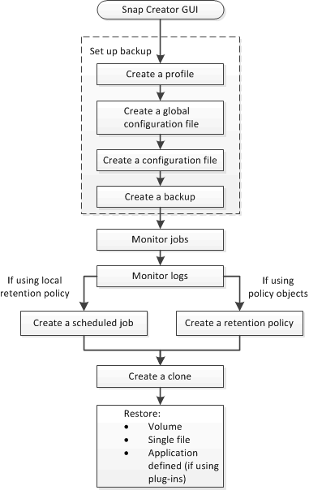

= 備份與還原工作流程
:allow-uri-read: 
:icons: font
:imagesdir: ../media/

[role="lead"]
您可以使用Snap Creator GUI、將工作流程當作備份與還原程序的指導方針。

執行這些工作時、必須執行Snap Creator、而且必須開啟Snap Creator GUI。如果不是、您可以在網頁瀏覽器中輸入Snap Creator Server的URL（"https://IP_address:gui_port"[] 依預設、連接埠為84443）、然後使用Snap Creator GUI認證登入。

下圖說明使用外掛程式時、執行系統備份與還原時的一組完整工作：

NOTE: 工作流程中概述的工作也可從命令列介面（CLI）執行。如需CLI的詳細資訊、請參閱相關參考資料、以取得有關CLI命令列的資訊。

*相關資訊*

xref:reference_guidelines_for_using_the_snap_creator_command_line.adoc[使用Snap Creator命令列介面的準則]
