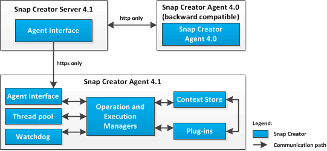

= SnapCreator Agent總覽
:allow-uri-read: 
:icons: font
:imagesdir: ../media/

[role="lead"]
Snap Creator Agent通常安裝在安裝應用程式或資料庫的同一主機上、可處理從Snap Creator Server到特定應用程式的靜止和取消靜止命令、以及外掛程式所在的位置。代理程式有時會縮短為Snap Creator中的scAgent。

Snap Creator Agent會透過代理程式REST風格的介面接收來自Snap Creator伺服器代理程式介面的通訊、而且僅透過HTTPS。這表示安全且加密的通訊、這是多租戶和雲端環境中非常重要的功能。自我簽署的憑證可讓您使用快照建立者代理程式產生的憑證。此外、SnapCreator Agent也受到儲存在磁碟上的可設定使用者和密碼組合的保護。

下圖說明Snap Creator Agent的架構：

Snap Creator Agent（有時會縮短至Snap Creator本身的scAgent）元件包含下列部分：

* *營運與執行經理*
+
Operations Manager負責處理傳入、傳出和已完成的要求。執行管理程式負責執行要求。

* *執行緒集區*
+
執行緒集區由工作執行緒所組成、用於執行多項工作。

+
這會決定任何指定時間的並行作業數量。執行管理程式會執行外掛程式、並在執行緒集區的其中一個執行緒中執行。如果執行緒集區有八個執行緒、您可以同時執行八個外掛程式作業。新的傳入作業會排入佇列、直到執行緒再次空閒為止。

* * Watchdch*
+
由執行管理程式針對特定作業觸發、通常是靜止、監視程式會在指定時間後回傳至執行管理程式、以停止作業（如有必要）、並執行對應的復原作業。例如、會呼叫外掛程式靜止功能、將應用程式置於備份模式。監督程式會開始偵聽。如果未在指定的時間範圍內執行取消靜止、則監視程式會使應用程式靜止不動、並將其恢復為正常操作模式。這是為了確保資料庫不會陷入備份模式。

* *上下文儲存區*
+
在保留工作流程生命週期所需的所有資訊時、內容儲存區會視需要提供內容物件給外掛程式、如果工作流程失敗或從未完成、內容物件會在一段時間後刪除。

+
對於未完成或在未定義狀態下失敗的工作流程、安裝路徑/etc/agent.properties: context_lime_in_msec=1800000（預設值30分鐘）中指定的最大內容時間。如果增加此值、則Snap Creator Agent會佔用更多記憶體。

* *外掛程式工廠*
+
外掛程式原廠會啟動外掛程式、並確保外掛程式在隔離的空間中執行。外掛程式原廠也會與內容存放區通訊、以存取儲存的資訊。它也能使用外掛整合引擎、從Snap Creator執行Perl型和原生外掛程式。

+
SnapCreator代理程式也可以使用以Java以外的語言撰寫的外掛程式。

