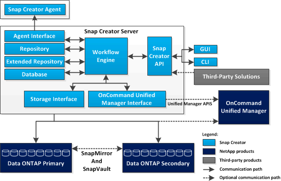

= SnapCreator伺服器總覽
:allow-uri-read: 
:icons: font
:imagesdir: ../media/

[role="lead"]
Snap Creator Server是Snap Creator Framework的主要引擎。

SnapCreator Server通常安裝在實體或虛擬主機上。伺服器主控Snap Creator圖形使用者介面（GUI）、以及儲存工作、排程、使用者、角色、設定檔、 和組態檔、以及外掛程式的中繼資料。SnapCreator Server有時會縮短為Snap Creator中的scServer。

下圖說明Snap Creator伺服器的架構：

以Java撰寫的Snap Creator Server元件通常安裝在中央備份伺服器上。在較小的環境中、此元件可安裝在安裝您要管理之應用程式或資料庫的主機上。Snap Creator伺服器元件包含下列部分：

* *工作流程引擎*
+
執行所有Snap Creator工作與命令。XML導向的多執行緒工作流程引擎是Snap Creator的核心元件。

* * Snap Creator應用程式設計介面（API）*
+
由Snap Creator GUI和命令列介面（CLI）使用。

* * SnapCreator儲存庫*
+
包含有關Snap Creator設定檔和組態檔的資訊、包括全域組態和設定檔層級的全域組態。

* * Snap Creator擴充儲存庫*
+
為在Snap Creator中執行的每個工作提供資料庫位置、包括工作的重要資訊、以及外掛程式所產生的中繼資料。

* * SnapCreator資料庫*
+
儲存有關Snap Creator排程和工作、以及角色型存取控制（RBAC）使用者和角色的資訊。

* *儲存介面*
+
做為NetApp儲存系統的常用Snap Creator介面、使用Data ONTAP NetApp API來處理作業、例如建立Snapshot複本、SnapVault 更新程式、以及SnapMirror更新。

* *《介面*》Active IQ Unified Manager
+
如需與NetAppActive IQ Unified Manager進行選擇性通訊、此介面會使用Unified Manager API、而非Data ONTAP 使用諸如建立Snapshot複本、SnapVault 更新資訊和SnapMirror更新等作業的API。

* *代理程式介面*
+
與Snap Creator代理程式通訊。雖然SnapCreator Agent和Snap Creator Server通常安裝在不同的實體或虛擬主機上、但兩者都可以安裝在同一部主機上。

+

NOTE: SnapCreator Server 4.3.0僅支援Snap Creator Agent 4.1.x和4.3.xSnapCreator Server 4.3.0不支援早於4.1.x的Snap Creator Agent版本

