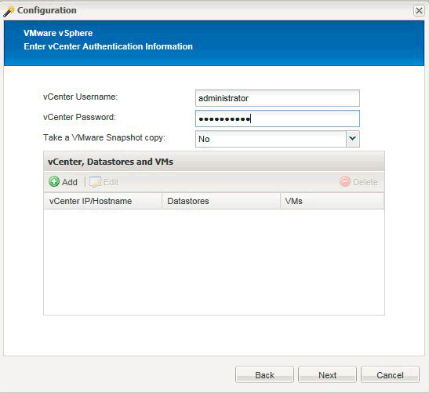
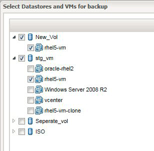
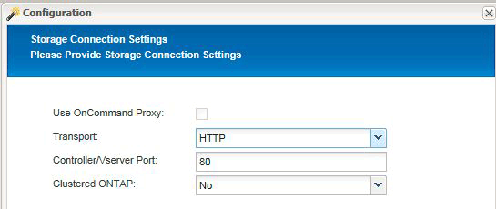
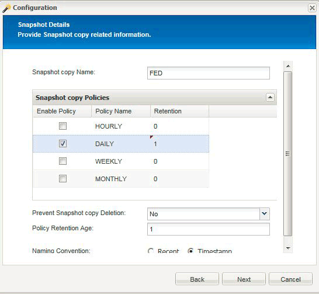

= 使用Hypervisor外掛程式時、將Snap Creator設定為多層應用程式靜止作業
:allow-uri-read: 
:icons: font
:imagesdir: ../media/

[role="lead"]
當您使用Hypervisor（也稱為「虛擬化」）外掛程式（VMware（VMware vCloud Director和VMware vSphere）、KVM和Citrix XenServer）、並想要執行多層應用程式靜止和備份作業時、您需要針對這類設定設定設定Snap Creator。

此組態可讓您靜止位於虛擬機器上的應用程式、靜止虛擬機器、然後建立Snapshot複本。

在此程序中、您將會使用一或多個子組態檔來指定父組態檔、藉此建立Hypervisor和應用程式組態。此父組態檔包含一般組態檔資訊、例如保留原則、SVM詳細資料、以及Hypervisor外掛程式的資訊。每個子組態檔都包含使用特定應用程式外掛程式執行Snap Creator靜止和取消靜止動作所需的詳細資料。

. 建立新的設定檔。
. 建立新組態。
+
.. 在「組態」頁面上、輸入組態檔的名稱。
+

NOTE: 預設會啟用密碼加密、以防止密碼以明文形式顯示在組態檔中。

.. 在「外掛程式類型」頁面上、選取*虛擬化外掛程式*。
.. 在「虛擬化外掛程式」頁面上、選取要設定的外掛程式。
.. 在外掛程式參數頁面上、提供與所選外掛程式選項相關的組態詳細資料。
+
在下列範例中、VMware vSphere是選取的虛擬化外掛程式。顯示的精靈畫面取決於您的選擇。

+
... 提供適當的資訊、然後按一下*「Add*（新增*）」。
+

... 在「New vCenter（新vCenter）」頁面上、提供vCenter IP和主機名稱、然後按一下*「Add*（新增*）」。
... 選取適用的資料存放區和虛擬機器進行備份。
+

... 確認您輸入的詳細資料正確無誤。
... 在「代理程式組態」頁面上、提供VMware代理程式詳細資料、這些是您安裝代理程式的系統詳細資料。
+

NOTE: 連接埠是代理程式正在偵聽的連接埠。

+
按一下「*測試代理程式連線*」以確定代理程式正在執行。

... 在Hypervisor + App Backup（Hypervisor +應用程式備份）頁面上、選取* Yes（是）*、因為Hypervisor和應用程式一致的備份都是必要的。
... 在Hypervisor + App組態頁面上、提供Hypervisor和應用程式組態的父組態名稱。
... 在「外掛程式類型」頁面上、選取*應用程式外掛程式*。
... 在「應用程式外掛程式」頁面上、選取要用於備份與還原的應用程式。
... 提供所選應用程式的詳細資料。
... 在「代理程式組態」頁面上、提供應用程式Snap Creator Agent詳細資料、這些詳細資料是您安裝代理程式的應用程式或資料庫主機的詳細資料。
+

NOTE: 一般而言、主機是正在備份的虛擬機器、其中有一個應用程式在執行。

+
按一下「*測試代理程式連線*」以確定代理程式正在執行。

... 在「摘要」頁面上、確認資訊、然後按一下「*完成*」。
... 在Hypervisor +應用程式頁面上、您有下列選項：
+
**** 若要將其他應用程式新增至此組態、請按一下*「Add*（新增*）」、然後重複本範例中的步驟vii到xii。
**** 若要從此組態中刪除應用程式、請選取項目、然後按一下*刪除*。
**** 若要繼續執行主要組態精靈、請按一下*下一步*。
+

NOTE: 如果列出多個應用程式、您可以在清單中上下移動應用程式、以重新排列清單順序。應用程式會以序列方式備份、因此如果應用程式需要在清單中的其他應用程式之前靜止、您就必須依照適當的順序來放置應用程式。

.. 在「Storage Connection Settings（儲存連線設定）」頁面上、提供下列資訊：
+
*** 對於*傳輸*選項、請選取* HTTPS *。
*** 對於*控制器/Vserver Port*選項、請保留預設設定（443）。
*** 對於*叢集ONTAP 式SESS*選項、請選取*是*。

.. 在「New Controller/vserver」（新控制器/虛擬伺服器）頁面上、提供控制器IP位址、使用者名稱和密碼。
.. 提供Snapshot複本詳細資料。
+

.. 在Snapshot Details（快照詳細資料）繼續頁面上、請勿選取* Consistency Group*（*一致性群組*）選項。
.. 在「資料保護」頁面上、請勿選取*資料傳輸*選項。
.. 驗證Summary（摘要）頁面上的資訊、然後按一下* Finish（完成）*。

*相關資訊*

xref:task_creating_profiles.adoc[建立設定檔]

xref:task_creating_configuration_files_using_sc_gui.adoc[正在建立組態檔]
