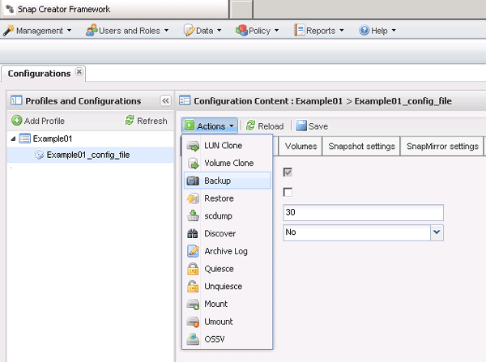
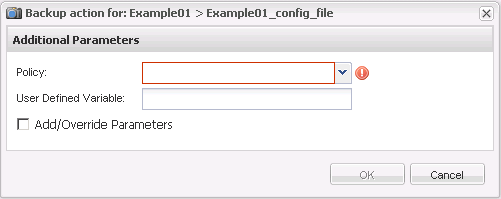

= 建立備份
:allow-uri-read: 
:icons: font
:imagesdir: ../media/

[role="lead"]
您可以使用Snap Creator GUI來建立備份。

必須符合下列條件之一：

* 必須在組態檔中定義備份原則；或者、
* 必須設定原則物件、並將其指派給設定檔。
+

NOTE: 如果已定義原則物件、則會取代組態檔中可能存在的任何項目。

+
.. 從Snap Creator GUI主功能表中、選取*管理*>*組態*。
.. 從*組態*索引標籤的*組態設定*窗格中、選取組態檔。
.. 選擇*操作*>*備份*。
+

.. 在「其他參數」對話方塊中、選取原則、然後按一下「*確定*」開始備份。
+

NOTE: 如果未將使用者建立的原則指派給組態、則「*原則*」下拉式清單中的可用選項包括每小時、每日、每週和每月。如果已將一或多個使用者建立的原則指派給組態、則會改為顯示在* Policy*下拉式清單中。

+

.. 確認「*主控台*」窗格中顯示有關備份工作的資訊。
+
image::../media/console_area_backup.gif[主控台區域備份]

+
在此範例中、輸出會指出已成功完成Snap Creator作業。

+

NOTE: 「*主控台*」窗格只會顯示最相關的資訊、這是詳細模式。若要查看剛執行之工作的詳細資訊、請選取頁面頂端的* Reports *>* Logs*。您可以從「記錄」檢視中選取設定檔、組態檔、記錄類型及特定記錄。

