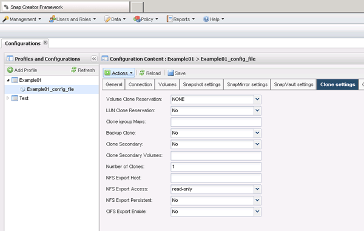

= 從新備份建立複本
:allow-uri-read: 
:icons: font
:imagesdir: ../media/

[role="lead"]
您可以從新的Snapshot複本複製磁碟區或LUN。

* Snap Creator伺服器必須與儲存系統通訊。
* 您必須以適當權限登入Snap Creator、才能執行複製作業。

此複製作業涉及複製新的Snapshot複本。

. 從SnapCreator圖形化使用者介面（GUI）的主功能表中、選取*管理*>*組態*。
. 在*設定檔與組態*窗格中、選取組態檔。
. 瀏覽至「* Clone settings *（*複製設定*）」索引標籤、確認設定正確。
+

. 根據所需的複本類型、選取* Actions *（動作*）和下列其中一個選項：
+
** LUN Clone
** Volume Clone

. 在「其他參數」對話方塊中、選取適當的原則、然後按一下「*確定*」開始複製程序。
. 在*主控台*窗格中、確認複製程序成功。

