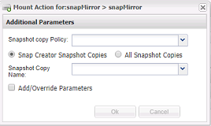

= 從現有備份建立複本
:allow-uri-read: 
:icons: font
:imagesdir: ../media/

[role="lead"]
您可以從現有備份複製磁碟區或LUN、做為來源。

* Snap Creator伺服器必須與儲存系統通訊。
* 您必須以適當權限登入Snap Creator、才能執行複製作業。

此複製作業包括掛載現有的Snapshot複本、然後複製現有的備份。

. 從Snap Creator GUI主功能表中、選取*管理*>*組態*。
. 從*組態*索引標籤的*組態設定*窗格中、選取組態檔。
. 選擇* Actions *>* Mount *。
. 在「其他參數」對話方塊中、選取包含要掛載之備份的控制器、磁碟區和原則、然後選取要掛載（複製）的Snapshot複本、再按一下「*確定*」開始複製程序。
+

+

NOTE: 記錄選取的Snapshot複本名稱。卸載備份時、必須選取相同的Snapshot複本名稱。

. 在*主控台*窗格中、確認複製程序成功。

