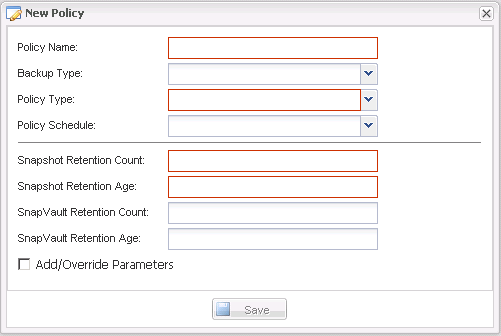

= 建立原則
:allow-uri-read: 
:icons: font
:imagesdir: ../media/

[role="lead"]
您可以使用Snap Creator GUI來設定多個具有不同保留計數的Snapshot原則、藉此建立新的保留原則。

您應該瞭解定義Snap Creator原則的準則。

. 從Snap Creator GUI主功能表中、選取* Policy*>* Policy Management *。
. 在* Policy Manager*（政策管理器）選項卡中，單擊* Create*（創建*）。
. 輸入詳細資料、然後按一下「*儲存*」。
+

+
|===
| 欄位 | 說明 

 a| 
原則名稱
 a| 
指定原則的名稱。

 a| 
備份類型
 a| 
（選用）選取備份類型。

 a| 
原則類型
 a| 
選取原則類型：

** *本地*
+
在主儲存設備上執行Snapshot複本。如果沒有SnapMirror或SnapVault 不相關的資訊、請選取此類型。

** SnapVault
+
在主儲存設備上建立Snapshot複本、並執行SnapVault 更新。必須為組態中的所有Volume啟用更新。SnapVault

** SnapMirror
+
在主儲存設備上建立Snapshot複本、並執行SnapMirror更新。必須為組態中的所有磁碟區啟用SnapMirror更新。

 a| 
原則排程
 a| 
（選用）選取要使用的原則排程。如果未指定原則排程、則不會自動執行這些動作。

 a| 
Snapshot保留計數
 a| 
輸入要保留的備份數。

 a| 
Snapshot保留時間
 a| 
輸入在刪除備份之前必須保留的最短存留時間。

 a| 
資料保留計數SnapVault
 a| 
如果您選取SnapVault 「用作原則類型」、請輸入SnapVault 適用於下列項目的保留計數：

 a| 
資料保留期限SnapVault
 a| 
如果您選取SnapVault 「用作」原則類型、請輸入SnapVault 有關「用作鞏固的年齡」。

 a| 
新增/置換參數
 a| 
可覆寫原則的某些參數。如果需要、請選取此核取方塊、然後新增要覆寫的參數。

|===

