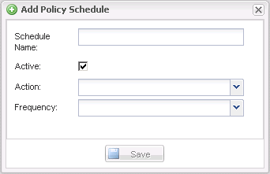

= 建立原則排程
:allow-uri-read: 
:icons: font
:imagesdir: ../media/

[role="lead"]
您可以選擇使用SnapCreator GUI來建立原則排程。

. 從Snap Creator GUI主功能表中、選取* Policy*>* Policy Schedules *。
. 在*原則排程*索引標籤中、按一下*建立*。
. 輸入排程名稱並選取動作和頻率、然後按一下「*儲存*」。
+
視您選取的頻率而定、您需要選取適當的時間欄位來執行排程工作。

+

