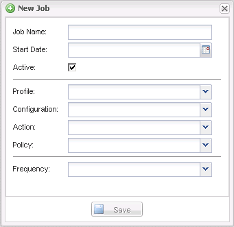

= 建立排程工作
:allow-uri-read: 
:icons: font
:imagesdir: ../media/

[role="lead"]
如果您使用本機保留原則（位於組態檔中）、可以使用Snap Creator圖形化使用者介面（GUI）排程器來建立排程和執行工作。排程器（包含在Snap Creator Server中）可排程備份（Snapshot複本）、LUN複製、Volume複製、應用程式定義的複本、開放式系統SnapVault 的更新（OSSV）傳輸、歸檔工作及自訂動作。

如果您打算使用原則物件而非本機保留原則、則應跳過此程序、改為建立原則排程。

. 從SnapCreator GUI的主功能表中、選取*管理*>*排程*、然後按一下*建立*。
. 在「新工作」視窗中、輸入工作的詳細資料。
+

+
|===
| 欄位 | 說明 

 a| 
工作名稱
 a| 
指定排程工作的名稱。

 a| 
開始日期
 a| 
選取今天的日期或未來日期。

 a| 
使用中
 a| 
設為「作用中」、表示工作將依照排程執行。使用中是預設設定。

 a| 
設定檔
 a| 
選取要與此工作相關聯的設定檔。

 a| 
組態
 a| 
選取要與此工作相關聯的組態。

 a| 
行動
 a| 
選取下列其中一個選項：

** *備份*：使用NetApp儲存技術建立備份。
** * Cloneworon*：使用LUN Clone命令建立備份並複製一或多個LUN。
** * Clonewor*：建立備份並複製磁碟區。
** * Clone（複製）*：執行外掛程式導向的複製作業。
** * OSSV*：使用開放式系統SnapVault 功能進行備份。
+
未建立主要備份。

** *架構*：僅執行歸檔記錄管理。
+
未建立備份。

** *自訂*：執行外掛程式定義的複製動作。

 a| 
原則
 a| 
選取要與此工作相關聯的原則。

 a| 
頻率
 a| 
選取此工作的頻率。視您的選擇而定、您必須選取適當的時間欄位來執行排程的工作。

+

|===
. 按一下「 * 儲存 * 」。

*相關資訊*

xref:task_creating_policy_schedules.adoc[建立原則排程]
