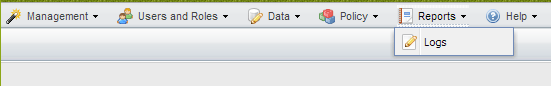
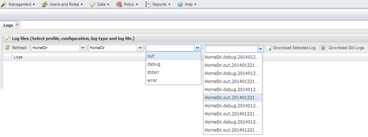

= 監控記錄
:allow-uri-read: 
:icons: font
:imagesdir: ../media/

[role="lead"]
您可以使用Snap Creator GUI來檢視每個設定檔和組態的記錄。

您可以檢視Out"、"偵錯"、"錯誤"和"錯誤"記錄、以協助疑難排解作業。如需這些疑難排解記錄的詳細資訊、請參閱相關參考資料。

. 從Snap Creator GUI主功能表中、選取* Reports*>* Logs*：
+

. 視需要依設定檔、組態檔、記錄類型或特定記錄選取記錄：
+

+
您也可以按一下*下載所選記錄*來下載所選記錄。下載的記錄檔會儲存在瀏覽器指定的目錄（或資料夾）中以供下載。

+

NOTE: 輸出、偵錯、stderr和代理程式記錄會依照組態檔中的log_NUM值所定義、保留下來、但錯誤記錄一律會附加。

*相關資訊*

xref:reference_logs.adoc[錯誤訊息類型和疑難排解記錄]
