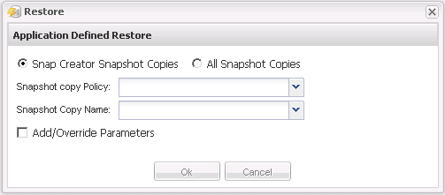

= 執行應用程式定義的還原作業
:allow-uri-read: 
:icons: font
:imagesdir: ../media/

[role="lead"]
如果您使用的是VMware、KVM和Xen外掛程式、則可以使用Snap Creator GUI執行應用程式定義的還原作業。

在某些VMware環境中、還原作業可能需要很長時間。在此情況下、您可以使用Snap Creator CLI或設定兩個代理程式：一個用於備份、另一個用於還原。

NOTE: 使用GUI的VMware還原作業僅支援Snap Creator Agent。

. 從Snap Creator GUI主功能表中、選取*管理*>*組態*。
. 從*組態*索引標籤的「設定檔與組態」窗格中、選取組態檔。
. 選擇*操作*>*還原*。
+
「應用程式定義的還原」對話方塊會顯示在右窗格中。

. 輸入還原詳細資料、然後按一下*確定*：
+

