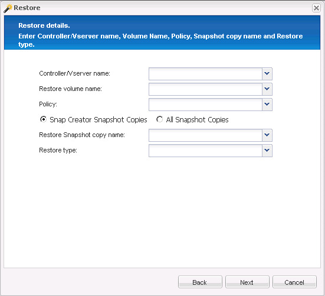

= 執行單一檔案還原作業
:allow-uri-read: 
:icons: font
:imagesdir: ../media/

[role="lead"]
您可以使用Snap Creator GUI執行單一檔案還原作業。

. 從SnapCreator GUI的主功能表中、選取*管理*>*組態*。
. 從「設定檔與組態」窗格的「組態」索引標籤中、選取組態檔。
. 選擇*操作*>*還原*。
+
「還原」精靈會在右窗格中開啟。

. 完成還原精靈：
+
.. 在「還原詳細資料」區段中、選取控制器或Vserver名稱、還原磁碟區名稱、原則及還原Snapshot複本名稱、然後從「還原類型」清單中選取「*單一檔案還原*」。
+

.. 選取要還原的檔案。
.. 選取要還原檔案的位置。
.. 檢閱摘要、然後按一下「*完成*」。

+
此時會出現一則警告訊息、詢問是否有更多項目要還原。

. 如果沒有要還原的項目、請按一下「*否*」、然後按一下「還原」確認頁面上的「*確定*」。
. 在主控台窗格中、檢閱顯示的訊息、確認您選取的檔案已成功還原。

