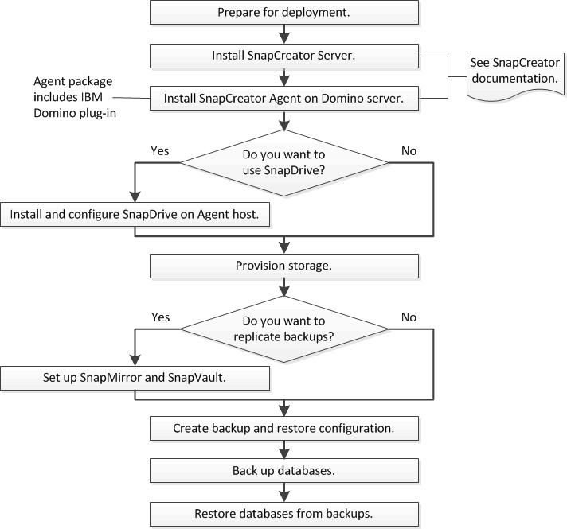

= IBM Domino備份與還原工作流程
:allow-uri-read: 
:icons: font
:imagesdir: ../media/

[role="lead"]
在使用IBM Domino外掛程式建立備份之前、您必須先安裝Snap Creator Server和Agent軟體、然後配置NetApp儲存設備。如果您計畫將Snapshot複本複製到二線儲存設備、以進行災難恢復和歸檔、則需要設定SnapMirror和SnapVault 不間斷關係。

NOTE: 尤其是在SAN環境中、您可能想要在SnapDrive Snap Creator Agent主機上使用支援功能來備份資料庫、或是掛載Snapshot複本以進行單一檔案還原。如需詳細資訊、請參閱 xref:concept_adding_commands_to_the_backup_and_restore_configuration.adoc[新增命令至備份與還原組態] 和 xref:concept_single_file_restore_in_fc_iscsi_environments.adoc[在SAN環境中執行單一檔案還原]。

