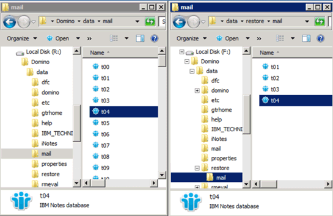

= 將檔案複製到資料還原目錄
:allow-uri-read: 
:icons: font
:imagesdir: ../media/

[role="lead"]
在您為要還原的檔案掛載Snapshot複本之後、即可將檔案複製到備份與還原組態檔中指定的Data Restore目錄。

. 從掛載的Snapshot複本複製要還原的檔案。
. 將檔案貼到備份與還原組態檔中指定的資料還原目錄。
+
以下範例說明如何將資料庫檔案t04.nsf從R：磁碟機上掛載的Snapshot複本複本複製到組態檔中指定的資料還原目錄。

+

