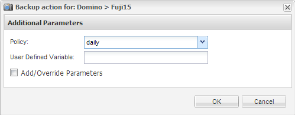

= 隨需備份資料庫
:allow-uri-read: 
:icons: font
:imagesdir: ../media/

[role="lead"]
您應該在NetApp儲存設備中提供資料庫時、立即備份資料庫。您可以在初始備份之後排程重複備份。

您應該已經建立備份的組態檔、如所述 xref:task_using_the_gui_to_create_a_configuration_file.adoc[建立組態檔]。

. 在「設定檔與組態」窗格中、選取組態檔、然後按一下「*動作*」>「*備份*」。
. 在「其他參數」對話方塊的「*原則*」下拉式清單中、選取備份工作的原則、然後按一下「*確定*」。
+

+

NOTE: 您必須在組態檔中設定原則。

+
SnapCreator會啟動備份工作。工作資訊會顯示在主控台窗格中。

