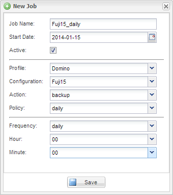

= 排程備份
:allow-uri-read: 
:icons: font
:imagesdir: ../media/

[role="lead"]
您可以在執行初始備份之後排程重複的備份工作。

您應該已經建立備份的組態檔、如所述 xref:task_using_the_gui_to_create_a_configuration_file.adoc[建立組態檔]。

. 在「設定檔與組態」窗格中、選取組態檔、然後按一下「Snap Creator Framework」視窗頂端的「*管理*>*排程」。
. 在「工作」窗格中、按一下「*建立*」
. 在「新工作」對話方塊中、指定工作資訊：
+
|===
| 針對此欄位... | 執行此動作... 

 a| 
工作名稱
 a| 
輸入工作名稱。

 a| 
開始日期
 a| 
使用行事曆控制項來選取排程開始的日期。

 a| 
使用中
 a| 
選取此方塊以啟動排程。取消選取此方塊以停用排程。

 a| 
設定檔
 a| 
選取組態檔的設定檔。

 a| 
組態
 a| 
選取組態檔。

 a| 
行動
 a| 
選取備份。

 a| 
原則
 a| 
選取備份工作的原則。*注意：*您必須在組態檔中設定原則。

 a| 
頻率
 a| 
選取工作應執行的頻率。視您的選擇而定、系統會顯示新欄位、您可以在其中指定執行工作的分鐘、小時和天。如果您要使用cron工作、請選取cron並輸入cron命令。

|===
+
以下範例說明如何排程每天午夜執行備份工作：

+

. 按一下「 * 儲存 * 」。
+
排程工作會列在「工作」窗格的「排程」索引標籤上。選取要執行、編輯或刪除的工作。

