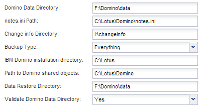
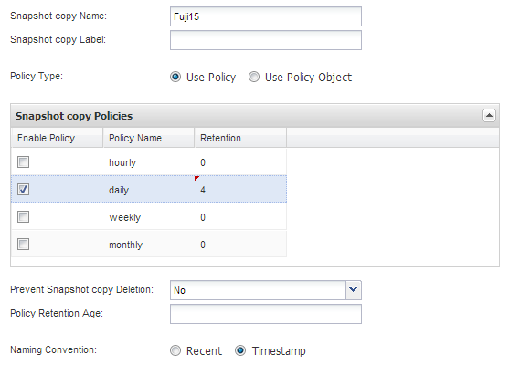

= 建立組態檔
:allow-uri-read: 
:icons: font
:imagesdir: ../media/

[role="lead"]
在備份IBM Domino資料庫之前、您必須先建立組態檔。組態檔是Snap Creator備份與還原作業的輸入。

組態和設定檔名稱中只允許使用英數字元和底線字元。名稱不能以數字開頭。

TIP: 許多站台使用設定檔範圍或站台範圍的全域組態檔、來套用儲存系統或VMware認證資訊來備份及還原組態。如需如何建立全域組態檔的詳細資訊、請參閱 https://library.netapp.com/ecm/ecm_download_file/ECMP12395422["SnapCreator Framework 4.1.2系統管理指南"]。

. 在「設定檔與組態」窗格中、按一下「*新增設定檔*」。
. 在「新設定檔」對話方塊中、輸入設定檔的名稱、然後按一下「*確定*」。
+
建立新設定檔會自動啟動「Snap Creator Framework組態」精靈。若要將新組態新增至現有的設定檔、請以滑鼠右鍵按一下該設定檔、然後選取*新組態*。

+
在「組態精靈」中、按一下「*下一步*」進入下一頁、然後按一下「*上一頁*」返回上一頁。

. 在「組態」頁面上、輸入組態名稱、然後指定是否要啟用密碼加密。
+
預設會啟用密碼加密、以防止密碼在組態檔中以純文字顯示。

+

TIP: 將游標移到精靈中的欄位上、即可顯示工具提示。

. 在「外掛程式類型」頁面上、選取*應用程式外掛程式*。
. 在「應用程式外掛程式」頁面上、選取* IBM Domino *。
. 在「外掛程式參數」頁面上、指定IBM Domino備份組態詳細資料：
+

NOTE: 下表中的範例適用於UNIX環境。您可以在表格後面的螢幕快照中檢視Windows設定範例。

+
|===
| GUI參數 | CLI參數 | 說明 

 a| 
Domino資料目錄
 a| 
Domino資料路徑
 a| 
Domino資料目錄的路徑。例如/DOMINO /資料。

 a| 
notes.ini路徑
 a| 
DOMIN_INI_PATH
 a| 
notes.ini檔案的路徑。例如/DOMINE/data/notes.in

 a| 
變更資訊目錄
 a| 
Domino變更資訊路徑
 a| 
變更資訊檔案的路徑。例如/changeinfo。*重要事項：*請確定您將變更資訊檔案儲存在Domino資料Volume以外的磁碟區。

 a| 
備份類型
 a| 
Domino資料庫類型
 a| 
要備份的資料庫檔案。從GUI下拉式清單中選取值、或在CLI命令中指定對應的編號：

** 一切（建議）（CLI = 0）
** *。box檔案（CLI/1）
** *。nsf、*。nSG和*。nsh檔案（CLI = 2）
** *。ntf檔案（CLI = 3）

 a| 
IBM Domino安裝目錄
 a| 
Lotus
 a| 
安裝Domino二進位檔案的目錄路徑。例如在Linux中、/opp/ibp/Domino（假設為預設安裝路徑）。在Windows中、是Domino Shared Objects目錄的父目錄。*附註：*這不是IBM Notes（前身為Lotus Notes）的路徑。

 a| 
Domino共用物件的路徑
 a| 
nots_ExecDirectory
 a| 
包含Domino共用物件檔案（.so或.dll）的路徑。例如、/opp/ibp/Domino / notes/latest / Linux。

 a| 
資料還原目錄
 a| 
DOMINO _還原資料路徑
 a| 
對於磁碟區還原（假設您要還原到備份所在的相同位置）、Domino資料目錄路徑。對於單一檔案還原（僅限NFS）、此位置與Domino Data Directory位於同一個磁碟區。例如/DOMINO /資料/還原。

 a| 
驗證Domino資料目錄
 a| 
validate_ Domino資料路徑
 a| 
如果Domino環境有多個掛載點、則某些掛載點可能位於NetApp儲存設備、而其他掛載點則可能不在。從GUI下拉式清單中選取值、或在CLI命令中指定對應的值：

** 是僅備份Domino資料目錄路徑上的檔案。
** 不備份Domino環境中的所有檔案、無論檔案在磁碟上的位置為何。

|===
+
下列範例顯示如何在Windows環境中完成欄位：

+

. 在「代理程式組態」頁面上、指定Snap Creator Agent連線資訊：
+
|===
| 針對此欄位... | 執行此動作... 

 a| 
IP/DNS
 a| 
輸入Snap Creator Agent主機的IP位址或DNS主機名稱。

 a| 
連接埠
 a| 
如果未使用SnapCreator Agent的預設連接埠（9090）、請輸入連接埠號碼。

 a| 
逾時（秒）
 a| 
保留預設值。

|===
. 當您對輸入項目感到滿意時、請按一下*測試代理程式連線*來驗證與代理程式的連線。
+

NOTE: 如果代理程式沒有回應、請驗證代理程式詳細資料、並確認主機名稱解析是否正常運作。

. 在「Storage Connection settings（儲存連線設定）」頁面上、指定主要儲存系統上儲存虛擬機器（SVM、先前稱為Vserver）的連線資訊：
+
|===
| 針對此欄位... | 執行此動作... 

 a| 
傳輸
 a| 
選取與SVM進行通訊的傳輸傳輸傳輸傳輸傳輸協定：HTTP或HTTPS。

 a| 
控制器/ Vserver連接埠
 a| 
如果您未使用SVM的預設連接埠（HTTP為80、HTTPS為443）、請輸入連接埠號碼。

|===
+
*附註：*如需瞭解如何使用OnCommand 此功能的資訊、請參閱 https://library.netapp.com/ecm/ecm_download_file/ECMP12395422["SnapCreator Framework 4.1.2系統管理指南"]。

. 在「控制器/虛擬伺服器認證」頁面上、指定主要儲存系統上SVM的認證資料：
+
|===
| 針對此欄位... | 執行此動作... 

 a| 
控制器/Vserver IP或名稱
 a| 
輸入SVM主機的IP位址或DNS主機名稱。

 a| 
控制器/ Vserver使用者
 a| 
輸入SVM主機的使用者名稱。

 a| 
控制器/ Vserver密碼
 a| 
輸入SVM主機的密碼。

|===
+
*重要事項：*如果您打算將Snapshot複本複製到Snapmirror或SnapVault Sf目的地、您在此步驟中輸入的SVM名稱必須與您建立Snapmirror或SnapVault Sname關係時所使用的SVM名稱完全相符。如果您在建立關聯時指定完整網域名稱、則必須在此步驟中指定完整網域名稱、無論SnapCreator是否能以您提供的資訊找到SVM。案例很重要。

+
您可以使用SnapMirror show命令來檢查主儲存系統上SVM的名稱：SnapMirror show -destination-path destination_Svm:destination_volume、其中destination_Svm_name是目的地系統上SVM的名稱、destination_volume是該磁碟區。如需建立Snapmirror及SnapVault 相關性的詳細資訊、請參閱 xref:concept_snapmirror_and_snapvault_setup.adoc[SnapMirror與SnapVault SnapMirror設定]。

+
當您按一下*「下一步」*時、會顯示「控制器/虛擬伺服器磁碟區」視窗。

. 在「控制器/虛擬伺服器磁碟區」視窗中、從左窗格的可用磁碟區清單拖放到右窗格中要備份的磁碟區清單、然後按一下*「儲存*」、即可指定要備份的磁碟區。
+
指定的磁碟區會顯示在「控制器/虛擬伺服器認證」頁面上。

+

IMPORTANT: 如果您打算備份changeinfo目錄、則必須將包含該目錄的磁碟區設定為中繼資料磁碟區、如所述 xref:concept_use_meta_data_volumes_setting_to_back_up_the_changeinfo_directory.adoc[備份changeinfo目錄]。此選項可讓IBM Domino外掛程式建立changeinfo volume _after的Snapshot複本、以建立資料庫檔案的Snapshot複本。

. 在「控制器/虛擬伺服器認證」頁面上、如果您要指定要備份其他主要儲存系統的SVM詳細資料和磁碟區、請按一下「*新增*」。
. 在Snapshot詳細資料頁面上、指定Snapshot組態資訊：
+
|===
| 針對此欄位... | 執行此動作... 

 a| 
Snapshot複製名稱
 a| 
輸入Snapshot複本的名稱。*秘訣：*如果您想在組態檔中重複使用Snapshot複製名稱、請按一下*允許重複Snapshot複製名稱*。

 a| 
Snapshot複製標籤
 a| 
輸入Snapshot複本的說明文字。

 a| 
原則類型
 a| 
按一下「*使用原則*」、然後選取您要用於此組態的內建備份原則。選取原則之後、按一下* Retention（保留）*儲存格、以指定您要保留的原則類型快照複本數量。*附註：*如需如何使用原則物件的相關資訊、請參閱 https://library.netapp.com/ecm/ecm_download_file/ECMP12395422["SnapCreator Framework 4.1.2系統管理指南"]。

 a| 
防止刪除Snapshot複本
 a| 
只有當您不想讓SnapCreator自動刪除超過要保留的複本數目的Snapshot複本時、才指定「是」。*附註：*指定「是」可能會導致您超過每個磁碟區所支援的Snapshot複本數量。

 a| 
原則保留期限
 a| 
指定保留Snapshot複本的天數、超過要保留的複本數。您可以輸入原則類型：期限、例如每日：15、來指定每個原則類型的保留期限。

 a| 
命名慣例
 a| 
保留預設值。

|===
+
下列範例中指定的組態會執行每日備份並保留四個Snapshot複本：

+

. 如果您想要強制備份作業繼續進行、即使一個或多個資料庫處於不一致或毀損狀態、請在「Snapshot details d接續」頁面上、將*忽略應用程式錯誤*設為「Yes」（是）。
+
您應該忽略其餘欄位。

+

TIP: Domino環境可能包含數百或數千個資料庫。即使單一資料庫處於不一致或毀損狀態、備份也會失敗。啟用*忽略應用程式錯誤*可繼續備份。

. 在「Data Protection（資料保護）」頁面上、指定是否要執行選用的Snapshot複製複寫至次要儲存設備：
+
.. 按一下「* SnapMirror *」以鏡射Snapshot複本。
+
鏡射Snapshot複本的原則與主要Snapshot複本的原則相同。

.. 按一下「* SnapVault 」「*」「*」「建立Snapshot複本的歸
.. 指定歸檔Snapshot複本的原則。
.. 以下步驟提供相關指示<<STEP_81795CF9D6294AC891BC3D0CE4827CA3,13.>>。
.. 在* SnapVault 《等候時間*》中、輸入您希望Snap Creator等待SnapVault 完成此動作的分鐘數。
.. 您必須先設定SnapMirror和SnapVault 不相關的功能、才能將複寫作業複寫到二線儲存設備。如需詳細資訊、請參閱 xref:concept_snapmirror_and_snapvault_setup.adoc[SnapMirror與SnapVault SnapMirror設定]。

. 在「資料保護磁碟區」頁面上、按一下「*新增*」、然後選取主要儲存系統的SVM。
+
當您按一下*下一步*時、會顯示資料保護磁碟區選擇視窗。

. 在Data Protection Volume（資料保護磁碟區）選擇視窗中、從左窗格的可用磁碟區清單拖放到SnapVault 右窗格的SnapMirror和（或）地區的磁碟區清單中、指定要複寫的來源磁碟區、然後按一下「*儲存*」。
+
指定的磁碟區會顯示在「資料保護磁碟區」頁面上。

. 在「資料保護磁碟區」頁面上、如果您要指定要複寫另一個主要儲存系統的SVM詳細資料和磁碟區、請按一下「*新增*」。
. 在「資料保護關係」頁面上、指定Snapmirror鏡射和/或SnapVault 目的地系統上SVM的認證資料。
. 如果您偏好使用NetAppOnCommand Unified Manager API、而非Data ONTAP 使用Snapshot API來進行Snapshot複本和SnapMirror/SnapVault更新、請填寫DFM/OnCommand設定頁面上的欄位：
+
.. 如果您要接收Unified Manager警示、請按一下* Operations Manager主控台警示*、然後輸入Unified Manager虛擬機器所需的連線資訊。
.. 如果您使用NetApp管理主控台資料保護功能進行7-Mode SnapVault 的資訊複寫、請按一下* NetApp管理主控台資料保護功能*、然後輸入Unified Manager虛擬機器所需的連線資訊。

. 檢閱摘要、然後按一下「*完成*」。

SnapCreator會在「設定檔與組態」窗格中、列出指定設定檔下方的組態檔。您可以選取組態檔、然後按一下「組態內容」窗格中適當的索引標籤、來編輯組態。您可以按一下右鍵功能表中的*重新命名*來重新命名組態。您可以按一下右鍵功能表中的*刪除*來刪除組態。
