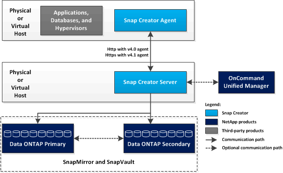

= SnapCreator架構
:allow-uri-read: 
:icons: font
:imagesdir: ../media/

[role="lead"]
SnapCreator具有功能齊全的伺服器與代理程式架構、包含三個主要元件：SnapCreator Server、Snap Creator Agent及外掛程式。

SnapCreator可與下列高階圖表所示的各種技術與產品互動及整合：

高層圖表中的NetApp軟體產品為選用項目；除了Snapshot技術、其他軟體產品則不需要SnapCreator Framework才能正常運作。
