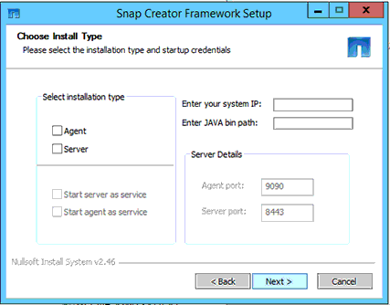

= 在Windows上安裝Snap Creator Agent
:allow-uri-read: 
:icons: font
:imagesdir: ../media/

[role="lead"]
您可以使用Windows安裝程式、在Windows主機上安裝Snap Creator Agent。

* 必須安裝JRE 1.8 Update 72或更新版本。
* 您必須擁有系統管理員層級的權限。
* 預設連接埠（9090）或其他網路連接埠必須可用。
* 必須下載SnapCreator。
+
.. 按兩下Snap_Creator_Frameworkrelease-Windowsversion.exe檔案圖示（例如Snap_Creator_Framework4.1.0-windows64.exe）、啟動Snap Creator安裝程式。
.. 在歡迎頁面上、按一下*下一步*開始安裝。
.. 檢閱並接受授權合約條款。
.. 在「Choose Install Type」（選擇安裝類型）頁面上、設定下列設定以符合各種安裝類型：
+
*** *選擇安裝類型*
+
選擇*代理*。

*** *將代理程式啟動為服務*
+
選取此選項可在安裝程序完成後立即安裝並啟動* snapcreatoragentservice*。

+
如果未選取此選項、則會停用「代理程式連接埠」欄位。

+

NOTE: 如果未選取此選項、則不會安裝此服務、而且您必須從命令提示字元執行批次指令碼、手動啟動Snap Creator Agent。

*** *輸入您的系統IP*
+
選取此選項以提供安裝Snap Creator Server或Snap Creator Agent之系統的IP位址。此選項用於在Snap Creator安裝程序期間產生SSL憑證。

*** *輸入Java bin路徑*
+
選取此選項以提供Java Bin路徑來尋找KeyTool公用程式。KeyTool公用程式用於在Snap Creator安裝程序期間產生SSL憑證。

*** *代理連接埠*
+
接受預設連接埠（9090）或指定連接埠號碼。

+

+
.. 單擊 * 下一步 * 。
.. 在「Choose Install Location（選擇安裝位置）」頁面上、輸入Snap Creator安裝路徑或接受預設路徑（C：\Program Files\NetApp\Snap_Creator_Framework）、然後按「* Next*（下一步*）」。
+

NOTE: 如果您打算使用IBM Domino外掛程式、則必須選取Domino資料夾以外的位置。

.. 在「選擇開始功能表資料夾」頁面上、自訂「Windows開始功能表」中應顯示「Snap Creator」的資料夾、或是接受預設資料夾選項、然後按一下「*安裝*」。
.. 安裝完成後、按一下*下一步*。
+
在Snap Creator Agent服務安裝期間、如果選擇某項服務做為安裝選項的一部分、則會顯示命令提示字元。此程序會嘗試啟動現有的服務、因此您通常會看到本步驟所列的失敗訊息、您應該忽略這些訊息。

.. 按一下「*完成*」以關閉Windows安裝程式。

如果在安裝過程中未選擇*啟動代理程式做為服務*選項、則必須手動啟動Snap Creator Agent。

*相關資訊*

xref:task_installing_java_on_snap_creator_hosts.adoc[在Snap Creator主機上安裝Java]

xref:task_downloading_the_snap_creator_software.adoc[正在下載Snap Creator軟體]

xref:task_starting_the_agent_from_a_command_prompt.adoc[從命令提示字元啟動代理程式]
