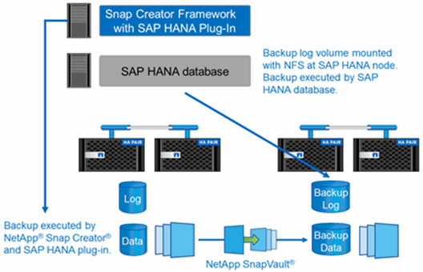

= 備份解決方案元件
:allow-uri-read: 
:icons: font
:imagesdir: ../media/

[role="lead"]
適用於SAP HANA的Snap Creator備份解決方案包含SAP HANA資料檔案備份（使用儲存型Snapshot複本）、將資料檔案備份複寫至次要異地備份位置、使用HANA資料庫記錄備份功能進行SAP HANA記錄檔備份、使用檔案型備份進行資料庫區塊完整性檢查、 以及資料檔案、記錄檔備份和SAP HANA備份目錄的管理。

資料庫備份是由Snap Creator搭配SAP HANA外掛程式執行。外掛程式可確保資料庫一致性、使在主要儲存系統上建立的Snapshot複本、以SAP HANA資料庫的一致映像為基礎。

SnapCreator可讓您使用SnapVault 還原功能、將一致的資料庫影像複寫到二線儲存設備。一般而言、主要儲存設備的備份和次要儲存設備的備份會定義不同的保留原則。SnapCreator可處理主要儲存設備和次要儲存設備的保留問題。

SAP HANA資料庫工具會自動執行記錄備份。記錄備份目的地不應位於資料庫記錄磁碟區所在的相同儲存系統上。建議您將記錄備份目的地設定在使用SnapVault NetApp複寫資料庫備份的同一個次要儲存設備上。有了這項組態、次要儲存設備的可用度需求與主要儲存設備類似、因此一律可將記錄備份寫入次要儲存設備。

備份排程和保留政策必須根據客戶需求加以定義。下表顯示不同排程和保留原則的組態範例。

|===
|  | 由Snap Creator執行 | 主儲存設備 | 二線儲存設備 

 a| 
資料庫備份
 a| 
附表1：每4小時
 a| 
保留時間：6（\=>6個每小時Snapshot複本）
 a| 
保留時間：6（\=>6個每小時Snapshot複本）

 a| 
附表2：每日一次
 a| 
保留：3（\=> 3個每日Snapshot複本）
 a| 
保留：28（4週）（\=>28個每日Snapshot複本）
 a| 
記錄備份

 a| 
SAP HANA資料庫工具排程：每15分鐘一次
 a| 
不適用
 a| 
保留：28天（4週）
 a| 
區塊完整性檢查

|===
在此範例中、主儲存設備會保留六個小時和三個每日備份。在二線儲存設備上、資料庫備份會保留四週。若要恢復任何資料備份、您必須為記錄備份設定相同的保留。
