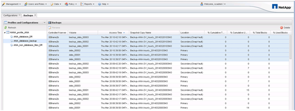
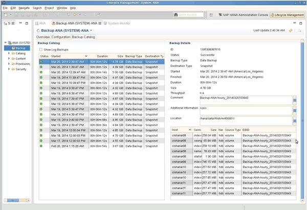

= 檢閱SAP HANA Studio中的可用備份
:allow-uri-read: 
:icons: font
:imagesdir: ../media/

[role="lead"]
您可以在SAP HANA Studio中查看儲存Snapshot備份清單。

下圖中反白顯示的備份顯示名為「Backup（備份）-ANA（每小時）_20140320103943」的Snapshot複本。 這份備份包含SAP HANA系統三個資料磁碟區的Snapshot複本。備份也可從次要儲存設備取得。

當Snap Creator在SAP HANA備份目錄中登錄儲存Snapshot複本時、SnapCreator會將Snapshot複本名稱用作備份ID。在SAP HANA Studio中、儲存Snapshot備份可在備份目錄中看到。外部備份ID（EBID）的值與Snapshot複本名稱相同、如下圖所示。

在每次執行備份時、Snap Creator會根據針對不同排程（每小時、每日等）所定義的保留原則、刪除一線和二線儲存設備的Snapshot備份。

如果主要或次要儲存設備不存在備份、SnapCreator也會刪除SAP HANA備份目錄中的備份。SAP HANA備份目錄一律會顯示一線和（或）二線儲存設備上可用的完整備份清單。
