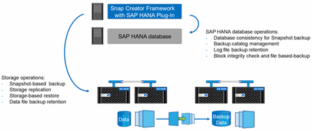

= SAP HANA外掛程式總覽
:allow-uri-read: 
:icons: font
:imagesdir: ../media/

[role="lead"]
SAP HANA外掛程式與SnapCreator Framework搭配運作、可為仰賴NetApp儲存設備後端的SAP HANA資料庫提供備份解決方案SnapCreator所建立的Snapshot備份已登錄至HANA目錄、並可在HANA Studio中看到。

SnapCreator Framework支援兩種SAP HANA資料庫：單一容器和多租戶資料庫容器（MDC）單一租戶資料庫。

SnapCreator和SAP HANA外掛程式均支援Data ONTAP 以7-Mode運作、並使用Data ONTAP NFS或Fibre Channel將SAP HANA資料庫節點連接至儲存控制器、以叢集式的形式運作。SAP HANA資料庫所需的介面可用於Service Pack Stack（SPS）7及更新版本。

Snap Creator Framework可與儲存系統通訊、以建立Snapshot複本、並使用SnapVault 效益技術將資料複製到二線儲存設備。SnapCreator也可用來還原SnapRestore 資料、例如在主儲存區使用「還原」功能、SnapVault 或從次儲存區使用「還原」功能。

SAP HANA的Snap Creator外掛程式使用SAP HANA hdbsqll用戶端執行SQL命令、以提供資料庫一致性、並管理SAP HANA備份目錄。SAP HANA外掛程式同時支援SAP認證硬體設備和量身打造的資料中心整合（TDI）方案。

SAP HANA的Snap Creator外掛程式使用SAP HANA hdbsqll用戶端執行SQL命令來執行下列工作：

* 提供資料庫一致性、以準備以儲存為基礎的Snapshot備份
* 管理檔案系統層級的記錄檔備份保留
* 管理SAP HANA備份目錄以進行資料檔案和記錄檔備份
* 執行檔案型備份以進行區塊完整性檢查

下圖顯示SnapCreator與儲存設備和SAP HANA資料庫之間的通訊路徑總覽。

SnapCreator會執行下列步驟來備份資料庫：

. 建立SAP HANA資料庫Snapshot複本、以在持續性層取得一致的映像。
. 建立資料磁碟區的儲存Snapshot複本。
. 在SAP HANA備份目錄中登錄儲存Snapshot備份。
. 刪除SAP HANA Snapshot複本。
. 針對SnapVault 資料Volume執行更新。
. 根據已定義的主要和次要儲存設備備份保留原則、刪除主要和/或次要儲存設備上的儲存Snapshot複本。
. 如果主儲存設備和次儲存設備上不再存在備份、則刪除SAP HANA備份目錄項目。
. 刪除檔案系統和SAP HANA備份目錄中所有早於最舊資料備份的記錄備份。

