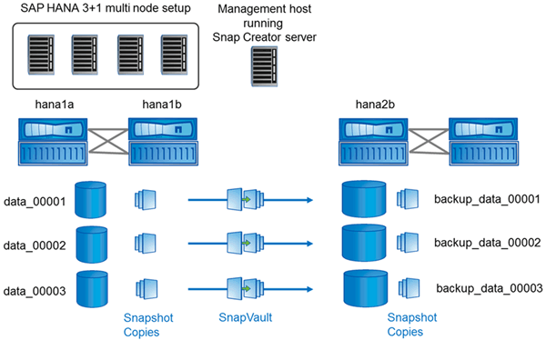

= 本指南中的設定假設
:allow-uri-read: 
:icons: font
:imagesdir: ../media/

[role="lead"]
雖然典型的Snap Creator安裝是假設伺服器安裝在一部主機上、而且代理程式安裝在另一部主機上、但本指南所使用的設定是以SAP HANA多節點設備為基礎。

在此組態中、SAP HANA資料庫會在3+1資料庫節點組態上執行、所有Snap Creator軟體元件（伺服器、代理程式和外掛程式）都會安裝在同一部主機上。

此設定中使用的NetApp儲存系統Data ONTAP 正在7-Mode中執行功能不全的運作。儲存層使用一組高可用度（HA）控制器。三個SAP HANA資料庫節點的資料和記錄磁碟區會分散到兩個儲存控制器。在範例設定中、另一個HA控制器配對的一個儲存控制器會用作次要儲存設備。每個資料磁碟區都會複寫到次要儲存設備上的專屬備份磁碟區。備份磁碟區的大小取決於將保留在次要儲存設備上的備份數量。

此處說明的所有Snap Creator和SAP HANA Studio作業、與執行叢集Data ONTAP 式功能的儲存系統相同。然而SnapVault 、儲存系統上的初始化功能不一、SnapVault 需要直接在儲存設備上執行的所有功能均與叢集Data ONTAP 式的功能不同。這些差異會在本指南中加以強調和說明。

下圖顯示主要儲存設備上的資料磁碟區、以及次要儲存設備的複寫路徑：

NOTE: 所有需要備份的磁碟區都必須在次要儲存控制器上建立。在此範例中、磁碟區備份_data_00001、備份資料_00002和備份資料_00003會在次要儲存控制器上建立。
