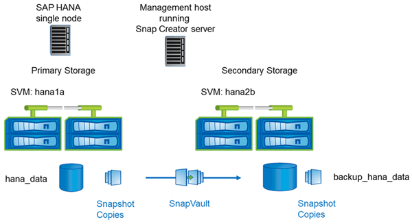

= 與叢集Data ONTAP 式的不一樣
:allow-uri-read: 
:icons: font
:imagesdir: ../media/

下圖顯示已搭配叢集Data ONTAP 式功能使用的設定。此設定以單節點SAP HANA組態為基礎、其中儲存虛擬機器（SVM）和Volume名稱如下圖所示。

在以7-Mode運作的叢集式VMware和VMware中、您準備、開始、恢復SnapVault 和還原等作業的方式各不相同Data ONTAP 。Data ONTAP這些差異會在本指南的對應章節中加以說明。
