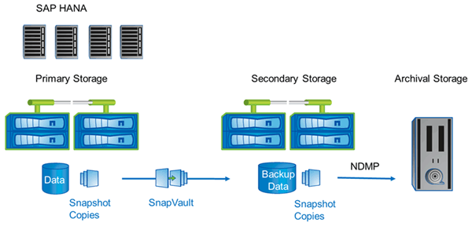

= NetApp解決方案
:allow-uri-read: 
:icons: font
:imagesdir: ../media/

[role="lead"]
使用 NetApp Snapshot 技術可在幾分鐘內建立資料庫備份。建立Snapshot複本所需的時間與資料庫大小無關、因為Snapshot複本不會移動任何資料區塊。

使用Snapshot技術也不會影響正式作業SAP系統的效能。因此、建立Snapshot複本可以排程、而不需考慮尖峰活動期間。SAP與NetApp客戶通常會在一天內排程數個線上Snapshot備份。例如、備份可能每四小時執行一次。這些Snapshot備份通常會在主要儲存系統上保留三到五天。

Snapshot複本也為還原與還原作業提供重要優勢。NetApp SnapRestore 功能可讓您將整個資料庫或部分資料庫還原至建立任何可用 Snapshot 複本的時間點。這項還原程序只需幾分鐘就能完成、完全不受資料庫大小限制。恢復程序所需的時間也大幅縮短、因為每天都會建立多個Snapshot複本、而且需要套用的記錄也較少。

Snapshot備份與作用中的線上資料儲存在相同的磁碟系統上。因此、NetApp建議使用Snapshot備份作為補充、而非取代磁碟或磁帶等次要位置的備份。雖然仍需要備份到次要位置、但還原與還原只需要這些備份的一小部分可能性。大部分的還原和還原動作都是使用SnapRestore 主儲存系統上的功能進行處理。只有在主儲存系統存放Snapshot複本毀損、或需要從Snapshot複本還原不再可用的備份時、才需要從次要位置進行還原。例如、您可能需要從兩週前還原備份。

備份到次要位置時、一律以在主要儲存設備上建立的Snapshot複本為基礎。因此、資料會直接從主要儲存系統讀取、而不會在SAP資料庫伺服器上產生負載。主要儲存設備會直接與次要儲存設備通訊、並使用 SnapVault 磁碟對磁碟備份將備份資料傳送至目的地。與SnapVault 傳統備份相比、NetApp的功能具有顯著優勢。在初始資料傳輸之後、所有資料都必須從來源傳輸到目的地、所有後續備份只會將變更的區塊複製到次要儲存設備。如此可大幅減少主儲存系統的負載、以及完整備份所需的時間。完整資料庫備份需要較少的磁碟空間、因為 SnapVault 只會在目的地儲存變更的區塊。

可能仍需要將資料備份到磁帶、做為長期備份。例如、這可能是每週備份、保留一年。在這種情況下、磁帶基礎架構可以直接連線至二線儲存設備、而且資料可以使用網路資料管理傳輸協定（NDMP）寫入磁帶。

