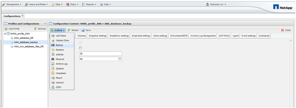
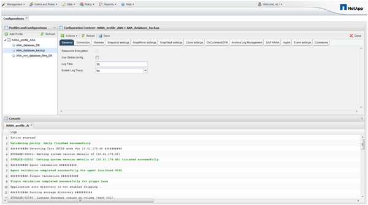

= 使用Snap Creator GUI備份資料庫
:allow-uri-read: 
:icons: font
:imagesdir: ../media/

[role="lead"]
您可以使用Snap Creator GUI備份資料庫。

. 選取* HANA資料庫備份組態*、然後選取*動作*>*備份*。
+

. 選取備份原則、然後按一下*確定*。
+
image::../media/sap_hana_database_backup_scfw_gui.gif[此影像由周邊文字說明。]

+
備份隨即開始。SnapCreator會觸發「SnapVault 『更新』、』和『Snap Creator』、直到資料複寫到次要儲存設備為止。等待時間已在組態期間設定、可在SnapVault 「還原設定」索引標籤中調整。SnapCreator會SnapVault 針對同一個儲存控制器上的每個磁碟區平行觸發更新、但每個儲存控制器會依序觸發更新。

+

