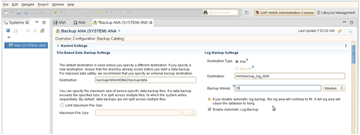

= 設定記錄備份
:allow-uri-read: 
:icons: font
:imagesdir: ../media/

[role="lead"]
記錄備份應儲存在與主儲存設備不同的儲存系統上。用於資料備份的儲存系統也可用於記錄備份。

在二線儲存設備上、需要設定磁碟區來保存記錄備份。請確定已關閉此磁碟區的自動Snapshot複本。

. 執行mount命令或編輯檔案系統表（Fstab）檔案、即可在每個資料庫節點上掛載磁碟區。
+
[listing]
----
hana2b:/vol/backup_log_ANA /mnt/backup_log_ANA nfs
rw,bg,vers=3,hard,timeo=600,rsize=65536,wsize=65536,actimeo=0,noatime   0  0
----
+
在SAP HANA Studio中、記錄備份目的地的設定如下圖所示。

+

