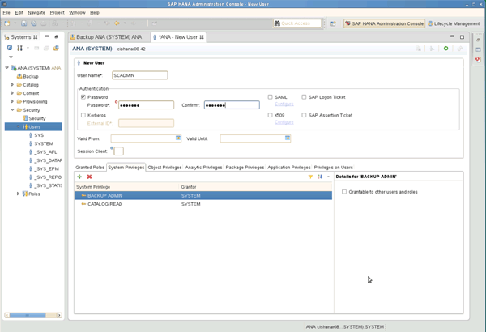

= 設定備份使用者和hdbuserstore
:allow-uri-read: 
:icons: font
:imagesdir: ../media/

[role="lead"]
您應該在HANA資料庫中設定專屬的資料庫使用者、以便使用Snap Creator執行備份作業。在第二個步驟中、您應該為此備份使用者設定SAP HANA使用者存放區金鑰。此使用者存放區金鑰用於Snap Creator SAP HANA外掛程式的組態。

備份使用者必須擁有下列權限：

* 備份管理
* 目錄讀取

. 在管理主機（即安裝SnapCreator的主機）上、會為屬於SAP HANA資料庫的所有資料庫主機設定使用者存放區金鑰。使用者存放區金鑰是以OS root使用者設定：hdbuserstore set keyhost 3[instance]15使用者密碼
. 設定所有四個資料庫節點的金鑰。
+
[listing]
----
mgmtsrv01:/usr/sap/hdbclient32 # ./hdbuserstore set SCADMIN08 cishanar08:34215 SCADMIN Password
mgmtsrv01:/usr/sap/hdbclient32 # ./hdbuserstore set SCADMIN09 cishanar09:34215 SCADMIN Password
mgmtsrv01:/usr/sap/hdbclient32 # ./hdbuserstore set SCADMIN10 cishanar10:34215 SCADMIN password
mgmtsrv01:/usr/sap/hdbclient32 # ./hdbuserstore set SCADMIN11 cishanar11:34215 SCADMIN Password
mgmtsrv01:/usr/sap/hdbclient32 # ./hdbuserstore LIST
DATA FILE       : /root/.hdb/mgmtsrv01/SSFS_HDB.DAT

KEY SCADMIN08
  ENV : cishanar08:34215
  USER: SCADMIN
KEY SCADMIN09
  ENV : cishanar09:34215
  USER: SCADMIN
KEY SCADMIN10
  ENV : cishanar10:34215
  USER: SCADMIN
KEY SCADMIN11
  ENV : cishanar11:34215
  USER: SCADMIN
mgmtsrv01:/usr/sap/hdbclient32
----

