= 設定SnapCreator Framework和SAP HANA資料庫備份
:allow-uri-read: 
:icons: font
:imagesdir: ../media/

[role="lead"]
您必須設定SnapCreator Framework和SAP HANA資料庫備份。

. 連線至SnapCreator圖形化使用者介面（GUI）： https://host:8443/ui/[]。
. 使用安裝期間設定的使用者名稱和密碼登入。按一下*登入*。
+
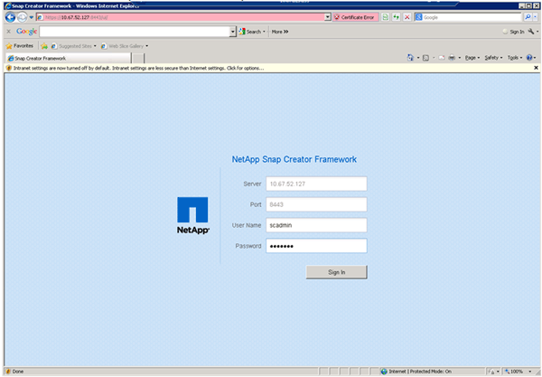

. 輸入設定檔名稱、然後按一下「*確定*」。
+
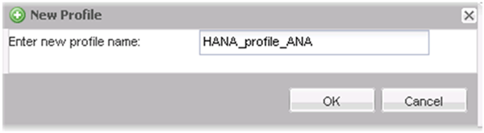

+
例如、「'ANA」是資料庫的SID。

. 輸入組態名稱、然後按一下「*下一步*」。
+
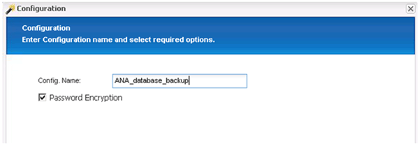

. 選擇*應用程式外掛程式*做為外掛程式類型、然後按一下*下一步*。
+
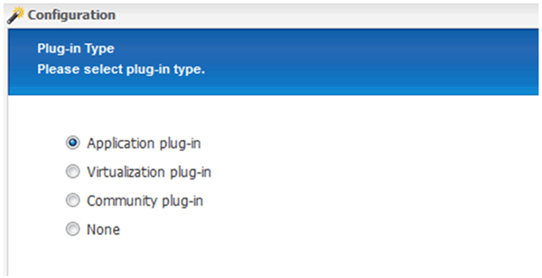

. 選取* SAP HANA *作為應用程式外掛程式、然後按一下*下一步*。
+
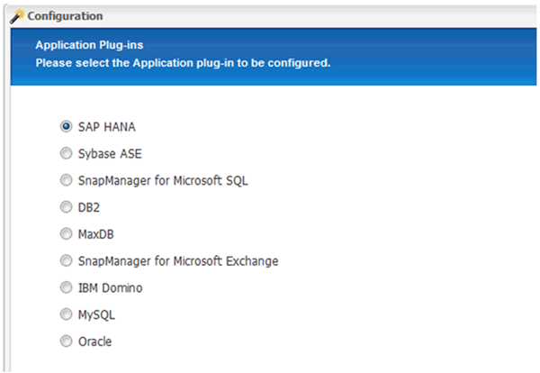

. 輸入下列組態詳細資料：
+
.. 從下拉式功能表中選取* Yes*、即可將組態搭配多租戶資料庫使用。對於單一容器資料庫、請選取* No*。
.. 如果多租戶資料庫容器設定為*否*、您必須提供資料庫的SID。
.. 如果「多租戶資料庫容器」設定為*是*、您必須為每個SAP HANA節點新增hdbuserstore金鑰。
.. 新增租戶資料庫的名稱。
.. 新增必須執行hdbsqll陳述式的HANA節點。
.. 輸入HANA節點執行個體編號。
.. 提供hdbsql執行檔的路徑。
.. 新增OSDB使用者。
.. 從下拉式清單中選取* Yes*以啟用記錄清理。
+
附註：

+
*** 參數「HANA _SID'」只有在參數「HANA多租戶資料庫」的值設定為「N」時才可使用
*** 對於具有「單一租戶」資源類型的多租戶資料庫容器（MDC）、SAP HANA Snapshot複本可搭配使用者存放區金鑰型驗證。如果「HANA多租戶資料庫」參數設為「Y」、則必須將「HANA USERSTORE_keys」參數設為適當的值。
*** 與非多租戶資料庫容器類似、支援檔案型備份與完整性檢查功能

.. 單擊 * 下一步 * 。

+
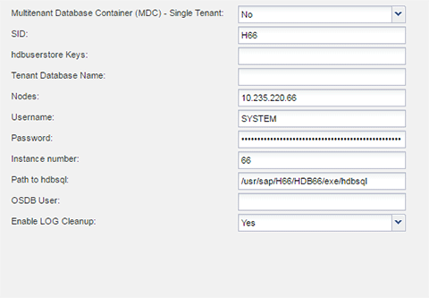

. 啟用「檔案型備份」作業：
+
.. 設定檔案備份位置。
.. 指定檔案備份前置碼。
.. 選取「*啟用檔案備份*」核取方塊。
.. 單擊 * 下一步 * 。
+
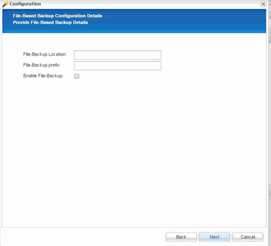

. 啟用資料庫完整性檢查作業：
+
.. 設定暫用檔案備份位置。
.. 選取「*啟用DB完整性檢查*」核取方塊。
.. 單擊 * 下一步 * 。

+
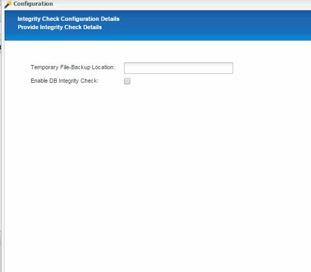

. 輸入代理程式組態參數的詳細資料、然後按一下*下一步*。
+
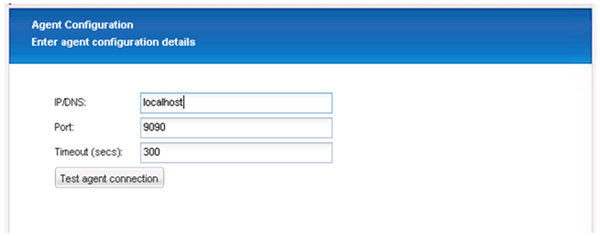

. 輸入儲存連線設定、然後按一下*下一步*。
+
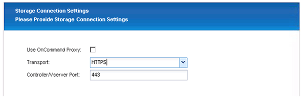

. 輸入儲存設備登入認證資料、然後按一下*下一步*。
+
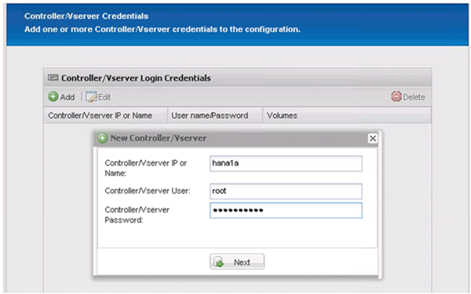

. 選取儲存在此儲存控制器上的資料磁碟區、然後按一下「*儲存*」。
+
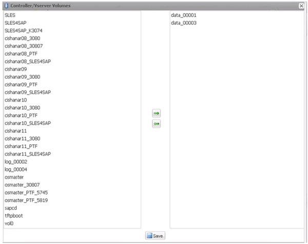

. 按一下「*新增*」以新增其他儲存控制器。
+
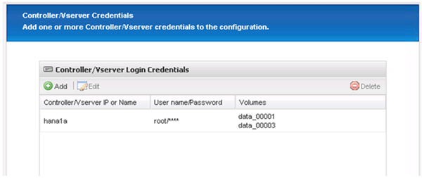

. 輸入儲存設備登入認證資料、然後按一下*下一步*。
+
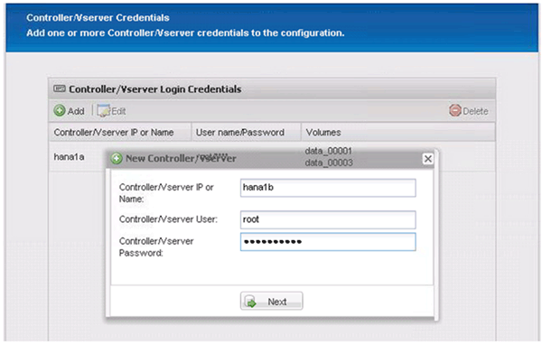

. 選取儲存在您所建立之第二個儲存控制器上的資料磁碟區、然後按一下「*儲存*」。
+
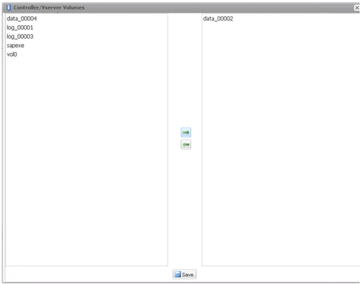

. 「控制器/Vserver認證」視窗會顯示您新增的儲存控制器和磁碟區。單擊 * 下一步 * 。
+
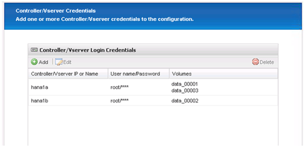

. 輸入Snapshot原則和保留組態。
+
保留每日三份與每小時八份Snapshot複本、只是一個範例、可視客戶需求而有所不同。

+

NOTE: 選擇*時間戳記*作為命名慣例。SAP HANA外掛程式不支援使用命名慣例* Recent *、因為Snapshot複本的時間戳記也用於SAP HANA備份目錄項目。

+
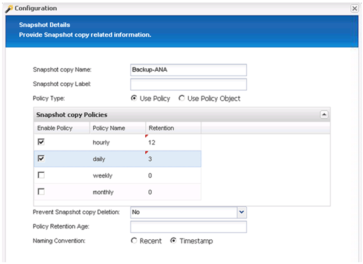

. 無需變更。單擊 * 下一步 * 。
+
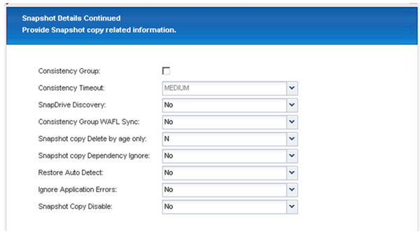

. 選取* SnapVault 《*》、然後設定SnapVault 「不保留」原則和SnapVault 「等候時間」。
+
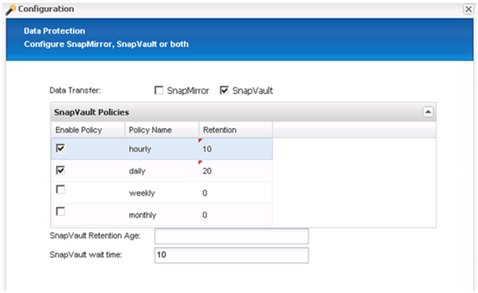

. 按一下「 * 新增 * 」。
+
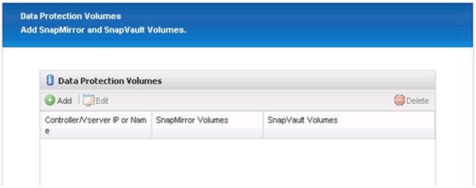

. 從清單中選取來源儲存控制器、然後按一下「*下一步*」。
+
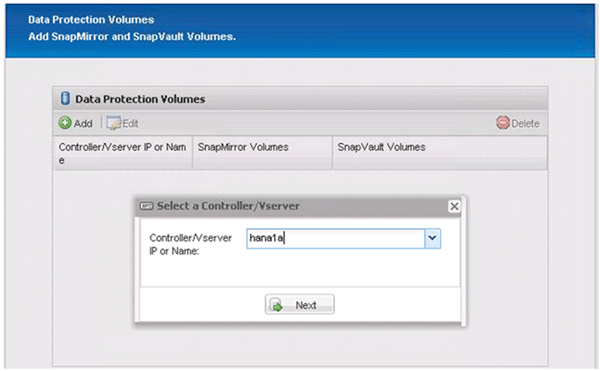

. 選取儲存在來源儲存控制器上的所有磁碟區、然後按一下「*儲存*」。
+
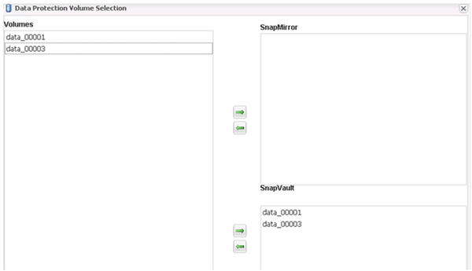

. 按一下「*新增*」、然後從清單中選取第二個來源儲存控制器、然後按一下「*下一步*」。
+
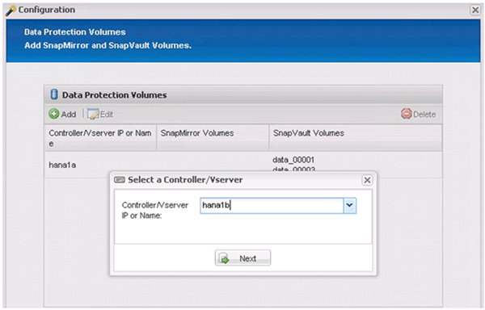

. 選取儲存在第二個來源儲存控制器上的所有磁碟區、然後按一下「*儲存*」。
+
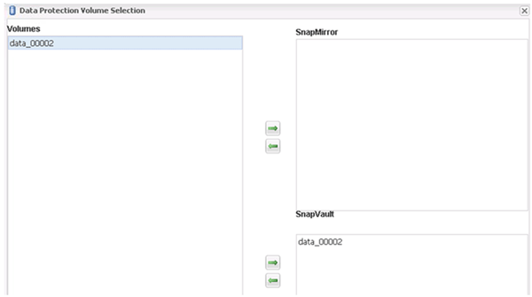

. 「資料保護磁碟區」視窗會顯示您所建立組態中應受保護的所有磁碟區。單擊 * 下一步 * 。
+
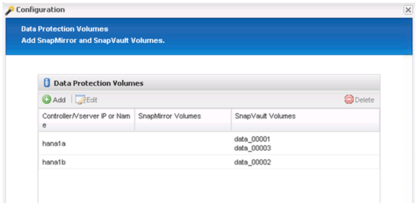

. 輸入目標儲存控制器的認證資料、然後按一下「*下一步*」。在此範例中、會使用「root」使用者認證來存取儲存系統。一般而言、專屬的備份使用者是在儲存系統上設定、然後搭配Snap Creator使用。
+
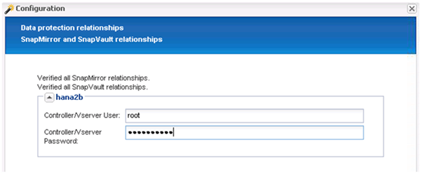

. 單擊 * 下一步 * 。
+
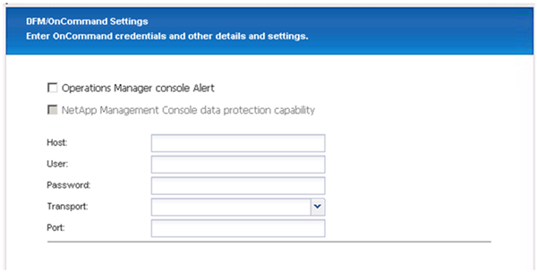

. 按一下「*完成*」以完成組態。
+
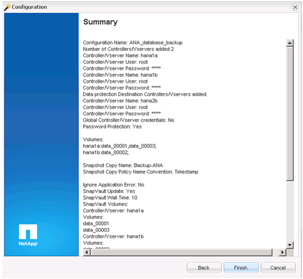

. 按一下* SnapVault 《*》設定*索引標籤。
. 從「* SnapVault 還原等候*」選項的下拉式清單中選取「*是*」、然後按一下「*儲存*」。
+
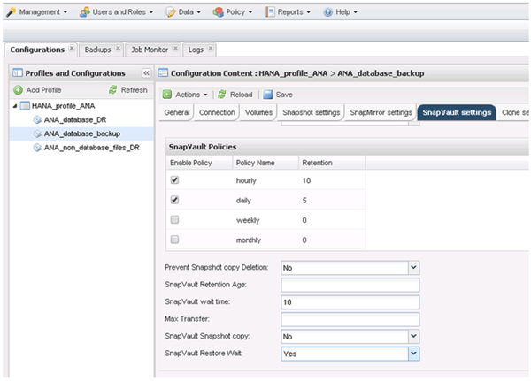

+
建議您使用專屬網路來處理複寫流量。如果您決定這麼做、您應該將此介面納入SnapCreator組態檔案、做為次要介面。

+
您也可以設定專屬的管理介面、以便Snap Creator使用未繫結至儲存控制器主機名稱的網路介面來存取來源或目標儲存系統。

+
[listing]
----
mgmtsrv01:/opt/NetApp/Snap_Creator_Framework_411/scServer4.1.1c/engine/configs/HANA_profile_ANA
# vi ANA_database_backup.conf

#####################################################################
########################
#     Connection Options                                            #
#####################################################################
########################
PORT=443
SECONDARY_INTERFACES=hana1a:hana1a-rep/hana2b;hana1b:hana1b-rep/hana2b
MANAGEMENT_INTERFACES=hana2b:hana2b-mgmt
----

