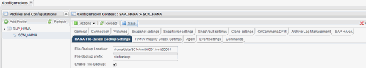

= 修改檔案型備份的組態
:allow-uri-read: 
:icons: font
:imagesdir: ../media/

[role="lead"]
您可以修改設定為「檔案型備份」的參數。後續的排程或隨選檔案型備份作業會反映更新的資訊。

. 按一下SAP HANA設定檔。
. 選取您要修改的組態、然後按一下「* HANA檔案型備份設定*」。
+

. 編輯資訊、然後按一下*「Save*（儲存*）」。

