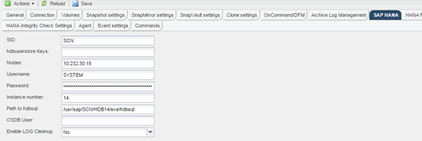

= 修改記錄備份的內部管理
:allow-uri-read: 
:icons: font
:imagesdir: ../media/

[role="lead"]
如果您想要停用記錄清除作業、您可以修改為記錄備份的整理所設定的參數。

. 選取您要修改的SAP HANA設定檔。
. 選取您要修改的組態、然後按一下「* SAP HANA Settings*」。
. 編輯「啟用記錄清除」參數、然後按一下「*儲存*」。
+

