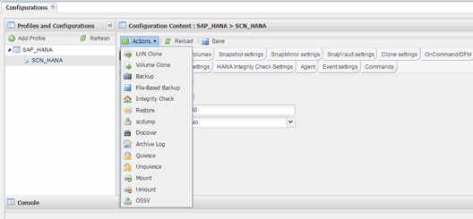
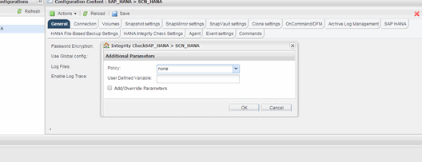

= 從Snap Creator GUI執行資料庫完整性檢查
:allow-uri-read: 
:icons: font
:imagesdir: ../media/

[role="lead"]
您可以從SnapCreator圖形化使用者介面（GUI）執行資料庫完整性檢查。

您必須在HANA Integrity Check Settings（HANA完整性檢查設定）索引標籤中啟用DB Integrity Check參數。

. 選取HANA資料庫完整性檢查組態。
. 選擇* Actions *>* Integrity Check *。
+

. 將「原則」選項設為*「無」*、然後按一下「*確定*」。
+

