= 從二線儲存設備還原及還原資料庫
:allow-uri-read: 
:icons: font
:imagesdir: ../media/

[role="lead"]
您可以從次要儲存設備還原及還原資料庫。

. 在SAP HANA Studio中、針對SAP HANA系統選取* recover*。
+
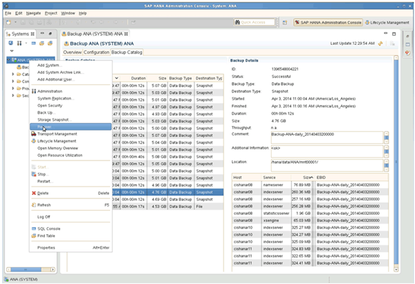

+
SAP HANA系統將會關閉。

. 選取恢復類型、然後按一下*「下一步」*。
+
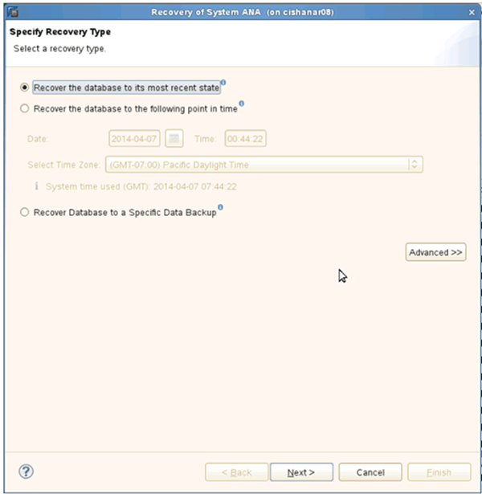

. 提供記錄備份位置、然後按一下*下一步*。
+
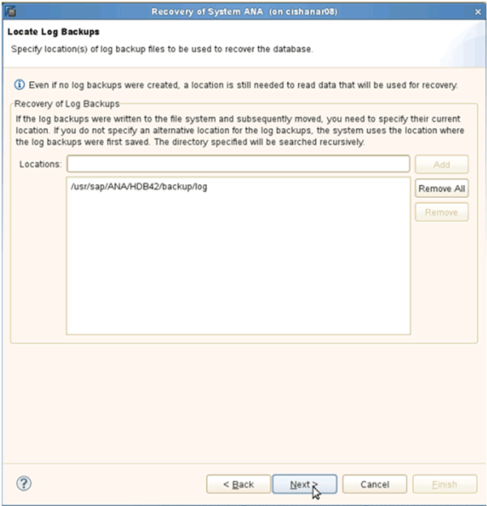

+
可用備份清單會根據備份目錄的內容顯示。

. 選取所需的備份並記下外部備份ID。
+
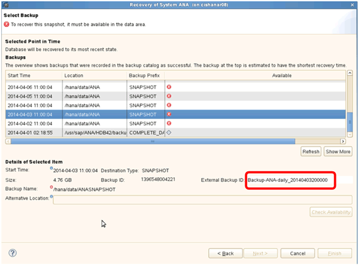

. 移至SnapCreator GUI。
. 選取SAP HANA系統、然後按一下「*動作*>*還原*」。
+
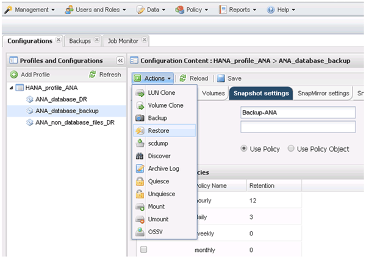

+
歡迎畫面隨即出現。

+
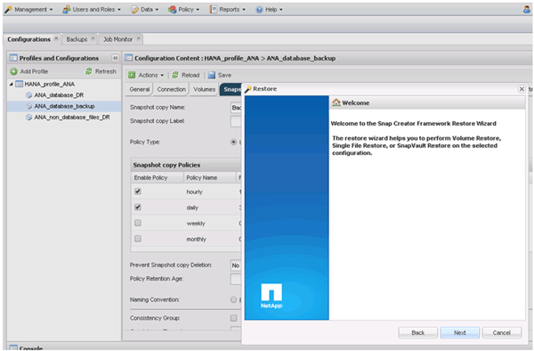

. 單擊 * 下一步 * 。
. 選擇*二級*並按*下一步*。
+
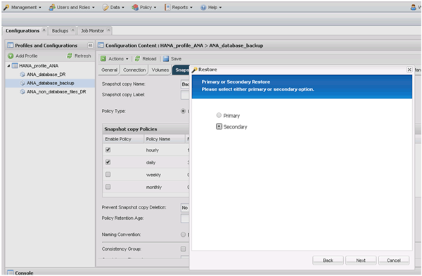

. 輸入所需資訊。Snapshot名稱與SAP HANA Studio中選取的備份ID有關。
+
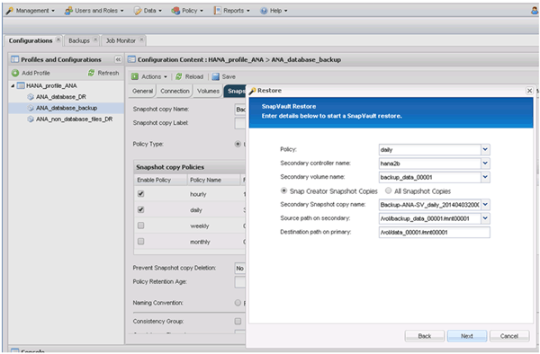

. 選擇*完成*。
+
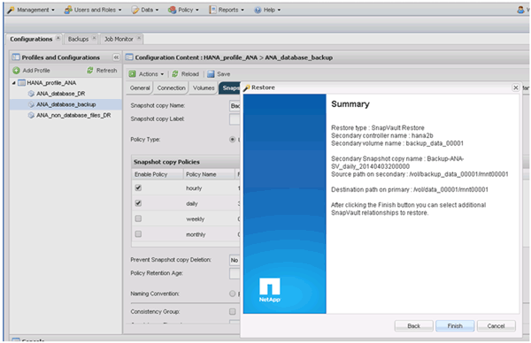

. 按一下「*是*」以新增更多要還原的項目。
+
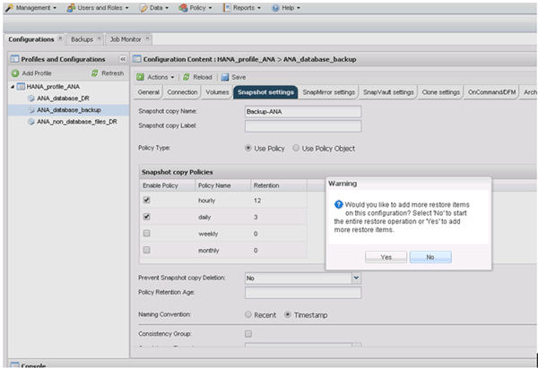

. 針對所有需要還原的磁碟區、提供必要資訊。在設定data_00001、data_00002和data_00003中、需要選取以進行還原程序。
+
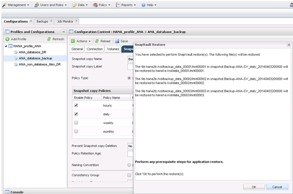

. 選取所有磁碟區後、選取*確定*以開始還原程序。
+
等待還原程序完成。

. 在每個資料庫節點上、重新掛載所有資料磁碟區、以清除「『NFS句點』」。
+
在此範例中、所有三個磁碟區都需要在每個資料庫節點上重新掛載。

+
[listing]
----
mount -o remount /hana/data/ANA/mnt00001
mount -o remount /hana/data/ANA/mnt00002
mount -o remount /hana/data/ANA/mnt00003
----
. 前往SAP HANA Studio、然後按一下「* Refresh*（*重新整理*）」以更新備份清單。
+
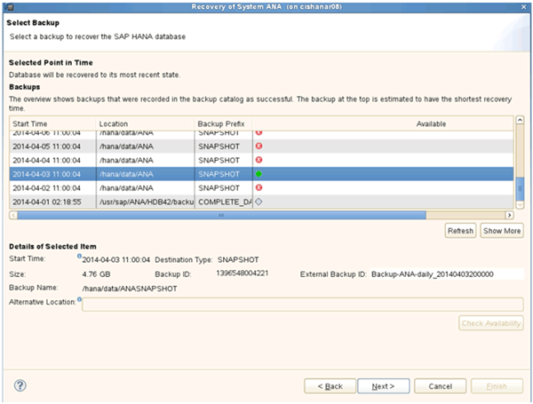

. 使用Snap Creator還原的備份會在備份清單中顯示綠色圖示。選取備份、然後按一下*下一步*。
. 視需要選取其他設定、然後按一下*下一步*。
+
image::../media/sap_hana_secondary_other_settings.gif[此影像由周邊文字說明。]

. 單擊*完成*。
+
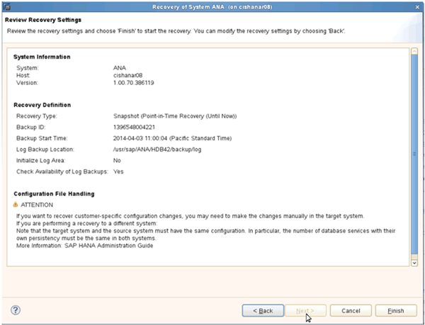

+
恢復程序隨即開始。

+
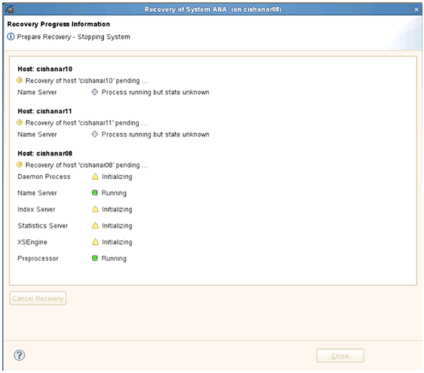

. 恢復程序完成後、SnapVault 如有需要、請繼續執行「還原關係」。
+
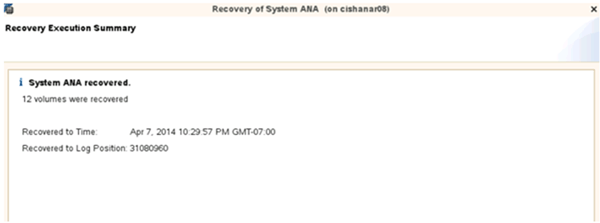

