= 從主要儲存設備還原及還原資料庫
:allow-uri-read: 
:icons: font
:imagesdir: ../media/

[role="lead"]
您可以從主要儲存設備還原及還原資料庫。

NOTE: 您無法從Snap Creator還原檔案型備份複本。

. 在SAP HANA Studio中、針對SAP HANA系統選取* recover*。
+
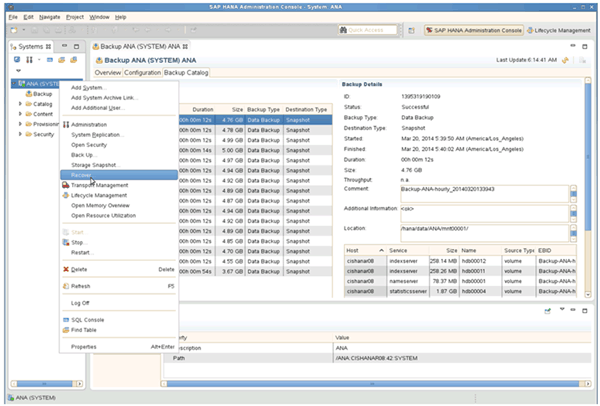

+
SAP HANA系統隨即關機。

. 選取恢復類型、然後按一下*「下一步」*。
+
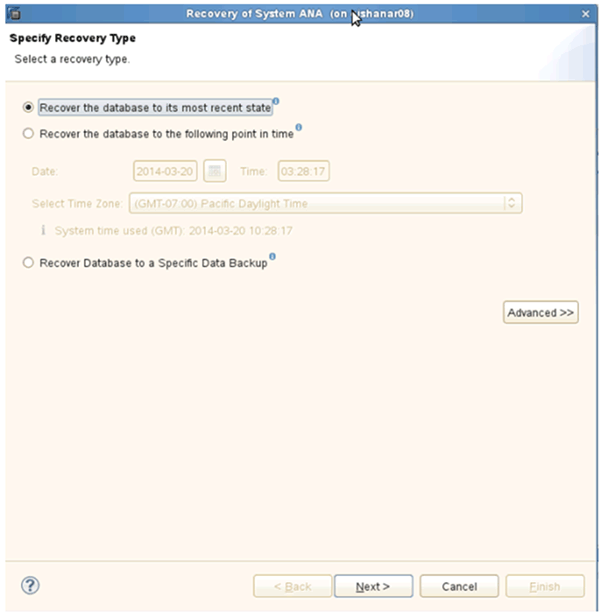

. 提供記錄備份位置、然後按一下*下一步*。
+
image::../media/sap_hana_recover_primary_log_backup_location.gif[此影像由周邊文字說明。]

+
您所看到的可用備份清單是根據備份目錄的內容而定。

. 選取所需的備份並記錄外部備份ID。
+
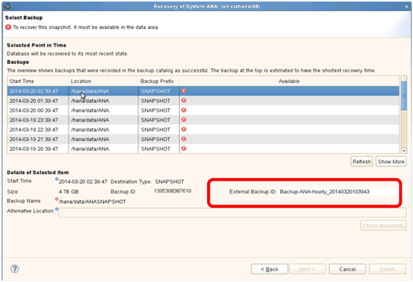

. 停用SnapVault 「不合作關係」。
+

NOTE: 只有叢集Data ONTAP 式的不需要執行此步驟。

+
如果您需要還原的Snapshot複本比目前用做SnapVault 為基礎Snapshot複本的Snapshot複本舊、您必須先停用SnapVault 叢集Data ONTAP 式故障恢復中的不再使用該功能。若要這麼做、請在備份叢集主控台上執行下列命令：

+
[listing]
----
hana::> snapmirror quiesce -destination-path hana2b:backup_hana_data
Operation succeeded: snapmirror quiesce for destination hana2b:backup_hana_data.

hana::> snapmirror delete -destination-path hana2b:backup_hana_data
Operation succeeded: snapmirror delete the relationship with destination hana2b:backup_hana_data.

hana::> snapmirror release -destination-path hana2b:backup_hana_data
[Job 6551] Job succeeded: SnapMirror Release Succeeded
----
. 在Snap Creator GUI中、選取SAP HANA系統、然後選取* Actions *>* Restore *。
+
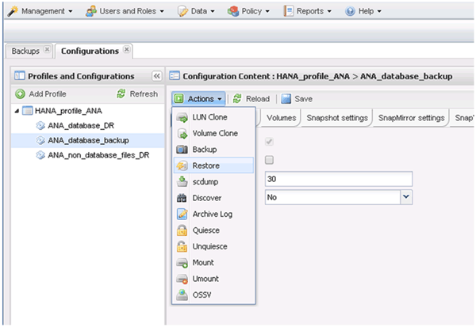

+
「歡迎使用SnapCreator Framework還原精靈」畫面隨即出現。

. 單擊 * 下一步 * 。
+
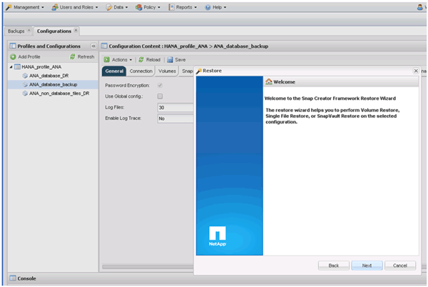

. 選擇* Primary*（主*）、然後按* Next*（下一步*）。
+
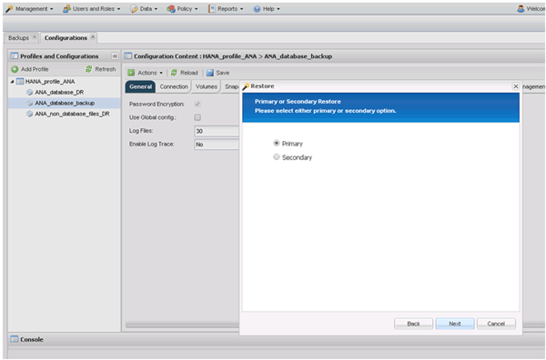

. 選取「從主要儲存設備還原」。
. 選取儲存控制器、磁碟區名稱和Snapshot名稱。
+
Snapshot名稱與SAP HANA Studio中選取的備份ID有關。

+
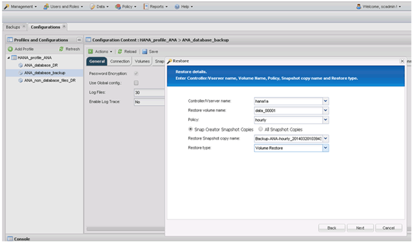

. 單擊*完成*。
+
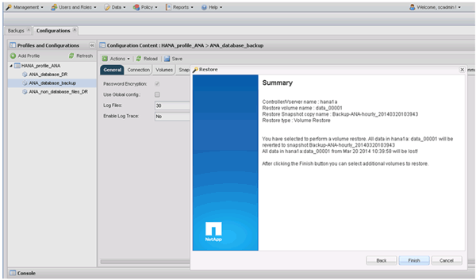

. 按一下「*是*」以新增更多還原項目。
+
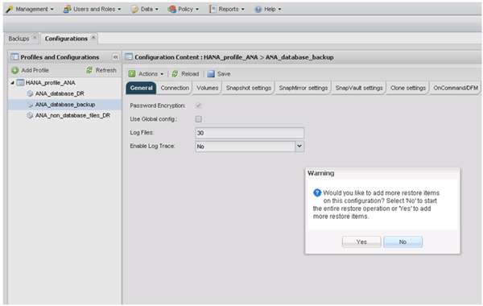

. 選取儲存控制器、其他磁碟區名稱和Snapshot名稱。
+
Snapshot名稱與SAP HANA Studio中選取的備份ID有關。

+
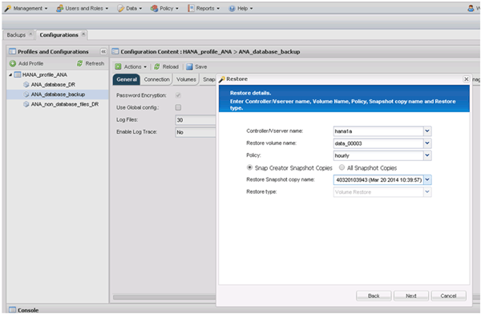

. 重複步驟10到13、直到新增所有必要的磁碟區為止；在我們的範例中、需要選取data_00001、data_00002和data_00003來進行還原程序。
. 選取所有磁碟區後、按一下「*確定*」開始還原程序。
+
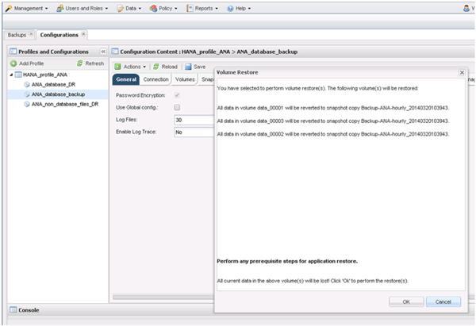

+
還原程序隨即開始。

+
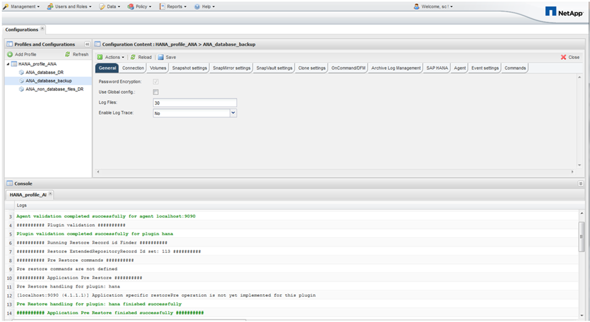

+
等待還原程序完成。

. 在每個資料庫節點上、重新掛載所有資料磁碟區、以清除過時的NFS處理程序。
+
在此範例中、所有三個磁碟區都需要在每個資料庫節點上重新掛載。

+
[listing]
----
mount -o remount /hana/data/ANA/mnt00001
mount -o remount /hana/data/ANA/mnt00002
mount -o remount /hana/data/ANA/mnt00003
----
. 前往SAP HANA Studio並按一下* Refresh*以更新可用備份清單。
+
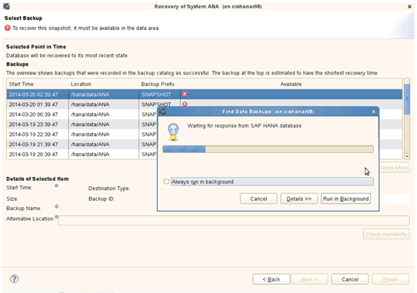

+
使用Snap Creator還原的備份會在備份清單中顯示綠色圖示。

. 選取備份、然後按一下*下一步*。
+
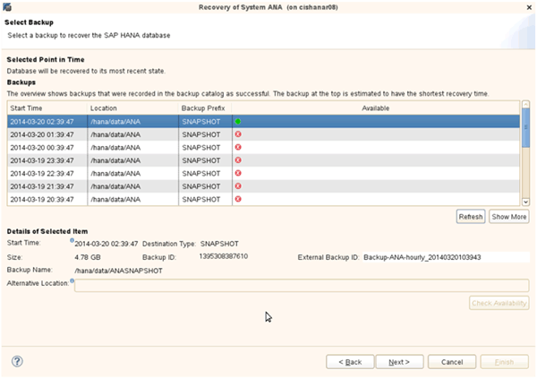

. 視需要選取其他設定、然後按一下*下一步*。
+
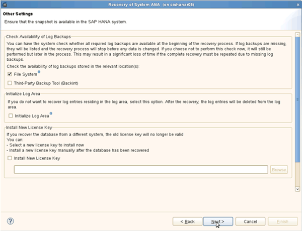

. 單擊*完成*。
+
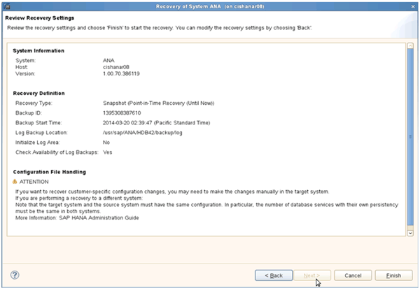

+
恢復程序隨即開始。

+
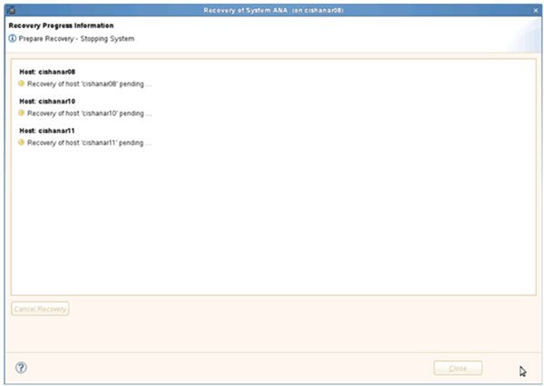

. 恢復完成後、SnapVault 如有需要、請繼續恢復彼此之間的關係。
+
image::../media/sap_hana_primary_recovery_execution_summary.gif[此影像由周邊文字說明。]

