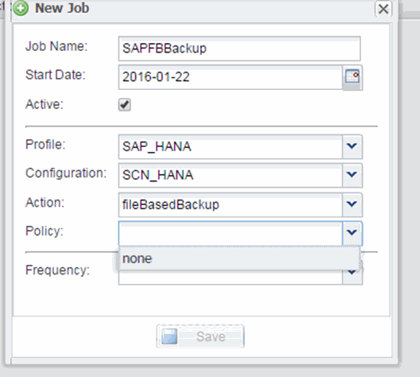

= 排程檔案型備份
:allow-uri-read: 
:icons: font
:imagesdir: ../media/

[role="lead"]
對於SAP HANA組態、您可以排程其他作業、例如檔案型備份和資料庫完整性檢查。您可以排定在特定時間間隔執行檔案型備份作業。

. 從SnapCreator GUI的主功能表中、選取*管理*>*排程*、然後按一下*建立*。
. 在「新工作」視窗中、輸入工作的詳細資料。
+
檔案型備份原則預設設為「無」。

+

